<!---

1. open TERMINAL
2. G:
3. cd "G:\BPLIM\02. Docs Internos\03. Manuais\External Server\"
4. RUN THE FOLLOWING LINE IN THE TERMINAL

> MAC > /Users/miguelportela/Documents/GitHub/Manuals/ExternalServer
> Gab. 1.19 C:\Users\mangelo.EEG\Documents\Manuals\ExternalServer

pandoc -V geometry:"paperwidth=210mm,paperheight=297mm,left=27mm,right=27mm,top=27mm,bottom=27mm" External_Server_Manual.md --pdf-engine=xelatex -o External_Server_Manual.pdf

ALTERNATIVE

https://marketplace.visualstudio.com/items?itemName=yzane.markdown-pdf

-->

<!---

About BPLIM
=========================

The ability to collect and accumulate microdata has been a powerful
function of central banks. In the scientific community, an increasing
number of research has been conducted using the micro-level
information. To enhance collaborations between the central bank and
the researchers, an advanced data-sharing platform is essential.
Accordingly, the Banco de Portugal Microdata Research Laboratory
(BPLIM) (*Laboratório de Investigação em Microdados do Banco de
Portugal*) is created to facilitate future scientific research effort
that incorporates the use of microdata. By eliminating the data access
barrier, BPLIM aims to inspire researches that effectively utilize the
Portuguese administrative micro datasets and contribute to our
understanding of the economic and financial challenges of our time.

Data Confidentiality
==================================

While researchers prefer unrestricted access to data, care must be
given to secure the confidentiality of the data providers. All access
granted to microdata should obey the applicable law and the data
should only be used for research purposes.

Therefore, the data is only made available to the Banco de Portugal's
internal researchers and those approved external researchers who have
agreed to the bank's legal provisions concerning the use of its data.
Specifically, each external researcher is required to sign a
Confidentiality Agreement with the bank and will only be allowed to
access a customized set of data that is tailored to his/her research
needs. All micro data sets made accessible to external researchers
will be anonymized and stored in information systems belonging to
Banco de Portugal (BdP).

Type of access to the Microdata varies according to levels of
confidentiality (low, medium, high).

-   **Low**: information that can be obtained to the public or
    scientific community by other institutions

-   **Medium**: information pertaining to institutions (firms, banks,
    etc.) not included in the previous case (some CB, CRC Firms, Bank
    Balance Sheet Data).

-   **High**: information about individuals or households not included
    in the **Low** case (CRC Individuals).

-->

<!--=========================================== --->
Access to the External Server
===========================================
1. Upon access approval, the User will be able to connect to the external server using one of two possibilities.
  - NoMachine client access (_preferred_): see **Appendix 4** for details on installation and use
  - Browser access (_low performance_): see **Appendix 5** for further details

2. Password policy:
  - The first password delivered must be changed at the first login.
  - After 60 days the password will expire: change the password within this time frame (see Appendix 3 for instructions on how to change the password)
  - The passwords to be specified must meet the requirements described in Appendix 3.

3. Upon access using 'NoMachine'

These are the first three screens you will see

{width="4.724409448818897in"
height="1.7223293963254593in"}

{width="4.724409448818897in"
height="3.059280402449694in"}

{width="4.724409448818897in"
height="2.4489752843394577in"}

4. Select the "**Kickoff Application Launcher**" menu (in the lower left corner):

{width="0.570670384951881in"
height="0.5637117235345582in"}

{width="2.3622047244094486in"
height="2.6394838145231847in"}

5.  Then you should:
  - Click on the "**Applications**" button
  - Select **"BPLIM"** and click on your project (i.e., "pxxx\_name"). At this stage, you should see a graphical environment ('Dolphin' application[^1]) like this:

{width="4.724409448818897in"
height="2.808662510936133in"}

You can see the prompt command line together with 'Dolphin' using the
keyboard shortcut 'F4'.

The directories that you have access to within the folder include:

+-----------------------------------+-----------------------------------+
| **initial\_dataset**              |                                   |
|                                   | Data sources provided by BPLIM.   |
|                                   |                                   |
|                                   | *You have                         |
|                                   | read-only access to this          |
|                                   | directory.*                       |
+-----------------------------------+-----------------------------------+
| **results**                       |                                   |
|                                   | Output files that                 |
|                                   | researchers wish to generate      |
|                                   | and extract from the server.      |
|                                   |                                   |
|                                   | *You                              |
|                                   | have read-write access to this    |
|                                   | directory.*                       |
+-----------------------------------+-----------------------------------+
| **tools**                         |                                   |
|                                   | Specific analysis tools.          |
|                                   |                                   |
|                                   | *You have read-only access to     |
|                                   | this directory.*                  |
+-----------------------------------+-----------------------------------+
| **work\_area**                    |                                   |
|                                   | Temporary                         |
|                                   | work directory.                   |
|                                   |                                   |
|                                   | *You have read-write              |
|                                   | access to this directory.*        |
+-----------------------------------+-----------------------------------+
| **/bplimext/doc/Manuals**         | Manuals and auxiliary files       |
|                                   | are available here.               |
+-----------------------------------+-----------------------------------+

  - You will have in your **work\_area** folder templates for both Stata and R. By default the template file is read-only.

  - By default you also have two files (see image above): (1)
    stata15mp.sh; (2) xstata15mp.sh. Files with the
    \"**sh**\" extension allows you to send commands to
    your operating system or to enter your operating system for
    interactive use. The first one starts Stata version 15 in
    non-graphical mode, while the second launches Stata 15 in
    graphical mode. You can start both applications by typing in the
    Linux shell, for example, 'xstata15mp.sh', or by double-clicking
    the file name in 'Dolphin'.[^2]

  - To reset and disconnect the remote desktop connection or session,
    you can simply log out of your remote session, as shown on the
    screenshot below. After you log out, close the window.[^3]

{width="3.1496062992125986in"
height="3.505206692913386in"}

Confirm before exiting by clicking on the **\"Logout\"** button to close the window[^4]

{width="1.1423611111111112in"
height="0.5228762029746282in"}

  - In case you do not logout, your session will be left open until your
    next login. You may use this facility to run your programs. However,
    one must be aware that this option uses resources from the server,
    so the efficient solution to run your programs "overnight" is using
    the batch mode as described in Step 6 below. Furthermore, in case
    the server is rebooted during a maintenance procedure your session
    will be automatically closed and unsaved documents will be lost. We
    recommend you save at regular intervals your statistical programs.

<> VERY IMPORTANT <>
=============================================

 - **Do not save files in your home area /home/USER_LOGIN. In case you exceed its size you will not be able to log in.**

 - Check regularly the size of your project in the harddrive. Open a Terminal and apply the following steps:

  1. **Move to the project folder:** cd /bplimext/projects/p000_xxx_yyy/
  2. **List project size:** du -h
  3. **Check size by folder and list folders with at least 1Gb:** du - -max-depth 1 -h | sort -n | grep G
  4. **Move to the folder 'work_area':** cd work_area
  5. **Repeat the check in this folder :** du - -max-depth 1 -h | sort -n | grep G
  6. **Identify duplicated and temporary files and delete them:** use the command 'rm'
  7. **Compress big files/folders you are not using at the moment:**
  7. **(a) Compress folders:** tar - zcvf YOUR_FOLDER.tar.gz YOUR_FOLDER
  7. **(b) Compress individual files:** gzip YOUR_FILE

Using the 'shell' in a Linux Operating System
=============================================

If you wish to run your programs in ***batch*** mode, then you must use the
*'shell'* of Linux. You can also use the 'shell' to organize the
files in your working space.

1.  The *'shell'*[^5] in Linux can be accessed from

RedHat \> Applications \> System \> Terminal
Terminal

{width="3.937007874015748in"
height="1.848682195975503in"}

2.  See the Appendix for a list of some of the most used commands.

3. In case you are using a non-English keyboard, the 'true' keyboard
    might be different from the one you see. The changes apply mostly
    to the symbols, not letters or numbers. For example, in case you
    have a Portuguese keyboard on your computer the '+' is now in key
    '?', or the '\*' is in SHIFT + ?. This issue is specific to the
    Operating System of your computer

4. Remember that Linux is case-sensitive: e.g., "LS" and "ls" are
    treated as different commands.

5. You can use the arrow keys to scroll up and down through the
    commands you\'ve entered.

6. You can use the "Tab" key to complete the command line
    automatically.

7. E.g., type the following line to list elements within a folder in a
    'human-readable' format, h, long list format, l, in reverse order,
    r, sort by modification time, t, and almost all files, A,

    ls -lArth

Using Stata
===========

**IMPORTANT**: do not save files in your home directory (/home/USER_LOGIN)

1. Stata can be accessed in interactive graphical or non-graphical
        modes.[^6]

  - Interactive non-graphical mode

    Move to the desired folder, e.g.,

      cd /bplimext/projects/I001\_jdoe/

    and type

      /opt/bplimext/stata15/stata-mp

{width="3.543307086614173in"
height="2.488604549431321in"}

  - You may add a 'path' to your system folder by typing, for the
    example on Stata 16, the following command in the shell "vi ~/.bash_profile" and adapt the following line
    
    PATH=\$PATH:\$HOME/.local/bin:\$HOME/bin:/opt/bplimext/stata16

  - For the interactive graphical mode click on the icons
    "**xstata14mp.sh**" (Stata 14) or
    "**xstata15mp.sh**" (Stata 15) located in the
    'desktop', depending on the desired Stata version,

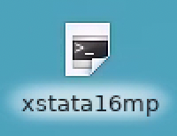{width="0.5905511811023622in"
height="0.46653543307086615in"}

{width="3.937007874015748in"
height="2.486382327209099in"}

  - You can use the 'Do-file Editor' in Stata to create your own
      "do-files" and "ado-files", or you can use
      *KWrite* editor (or 'gedit')

  - You can open it from **RedHat** \> **Applications**
      **Applications** \> **Utilities** \> **KWrite**. You can also launch 'KWrite' from the 'shell' by typing 'kwrite'

  - In case the icon is not on your desktop, use Dolphin, move to folder
    '/opt/bplimext/stata15', and drag and drop the file 'xstata-mp' into
    the desktop

2. To look for **"ado-files"**:

"Ado-files" are text files containing the Stata program. It is
advisable that one create and save his/her "ado-files" so the results
can be replicated later by running the saved "ado-files" on the
BPLIM's datasets.

Stata looks for "ado-files" in several places. When it comes to
personal ado-directories, they can be categorized in four ways:

  - (SITE), the directory for "ado-files" your site might have
    installed;

  - (PLUS), the directory for "ado-files" you might have
    installed;

  - (PERSONAL), the directory for "ado-files" you might have written;

  - (OLDPLACE), the directory where Stata users used to save their
    personally written ado-files.

The ado-files you have just written or those created for this project
can be found in the current directory (.).

 Specific 'ado-files' you may ask to be made available in the server
 will be placed in your folder
 '/bplimext/projects/YOURPROJECTID/tools'. You should add this folder
 to your Stata 'ado-files' folder by executing the following command
 within Stata,

  sysdir set PERSONAL "/bplimext/projects/YOURPROJECTID/tools"

 You may also edit your 'profile.do' file, located in your root folder,
 "/home/YOURPROJECTID/", and add key instructions you may want to be
 executed every time you start Stata. The above instruction is one of
 such cases. You can create, or edit, the file 'profile.do' using
 'Do-file Editor' within Stata ('vi profile.do' or KWrite are also a
 possibility).

 The ***sysdir*** command within Stata will tell you where they are on
 your computer:

{width="3.9368055555555554in"
height="2.2751399825021874in"}

Stata in 'batch' mode
===================================

1.  Start a *\'**shell**\'* in Linux and navigate to the directory
         of the "do-file" file that you want to run (ex: prog1.do)

 **cd /bplim/projects/I001\_jdoe/work\_area/** cd
 /bplimext/projects/I001\_jdoe/work\_area/

2. You might find it easier to use 'Dolphin' (= File Manager) to move
     over your folder structure. In this case, we recommend activating
     the 'shell' (= 'Terminal') associated with 'Dolphin'

  -  use Dolphin/File Manager

  - click 'F4' to activate the shell with Dolphin. Benefit: fast
         transition within folders and, at the same time, the ability
         to run shell commands

3. Create an ASCII file named, e.g., 'batch\_prog1'

4. Inside the file write just a line with the execution command you
     would type in the 'shell'; e.g.,

    /opt/bplimext/stata15/stata-mp do
    /bplimext/projects/BPlim\_inicial/work\_area/prog1.do

5. You can use, for example, the command line app 'vi' to create the batch file

{width="3.543307086614173in"
height="0.8180216535433071in"}

6. The batch file can also be created using apps like 'kwrite' or Stata
     'do file editor'

{width="3.543307086614173in"
height="1.1132370953630797in"}

or

{width="3.543307086614173in"
height="2.0134241032370954in"}

7. You may add the extension '.txt' to the name of the batch file, as
     sometimes Stata *doeditor* does not 'see' the file 'batch', while
     it 'sees' 'batch.txt'

8. Once the batch file is created one runs the .do file in batch mode
     by typing in the 'Terminal':

    at now --f batch.txt

9. Type 'man at' to see a further option of the command 'at'; e.g., one
     could type

    at now + 5 hours --f batch.txt

  or

    at now + 4 minutes --f batch\_prog1

  to run the Stata program within 5 hours or 4 minutes from now,
  respectively. 'man' is the help function in Linux

10. Type 'top' in the shell/Terminal to confirm the program is running

11. Under 'top' type 'i' to hide irrelevant processes (show less output)

12. To kill a running process with 'top' press 'k', for 'kill', write
    > the process number and then type '9'. The process number is
    > identified in the first column as PID

13. To get out of the top, type 'q'

14. Useful features of the command 'at':

  - 'atq': use it to see programs in the batch queue (an '=' sign
         indicates the program is running; an 'a' indicates it is in
         the queue and we see the time when it will be executed)

  - 'atrm \#': remove a batch from the batch queue

  - one can see how the batch is running by typing

      'tail --f logcrc\_may21.log'

 It allows you to see an updated version of the last lines of the log;
 *i.e.*, it updates each time the log is changed by Stata. A key
 advantage of 'tail' is that it does not interfere with the log file,
 namely, it does not write over it.

15. Another way to run a program in the background is by using the
     command 'screen'

  - 'screen' is useful when one wants to run Stata in interactive
         mode and still guarantee that if the network connection goes
         down one does not lose the session. We can simply kill the
         'NoMachine' session and recover it later by typing 'screen
         --r'

  - We can run several instances of 'screen'. If this is the case,
         after opening a new NoMachine session we need to type in the
         Terminal shell 'screen --d' to identify the running background
         sessions. We can retrieve a particular session by knowing the
         'pid' number and typing 'screen --r 34176'

Additional Statistical Software
=============================================

**IMPORTANT**: do not save files in your home directory (/home/USER_LOGIN)

 You can also use 'R' and 'python' by issuing in the shell the
 respective designation. Both applications can only be used in the
 'shell'. You can check the packages available in R by typing
 'installed.packages()'.

Using R
===========

1. As with Stata, R can be accessed in interactive graphical or non-graphical modes.

  - Interactive non-graphical mode: go the RedHat symbol and type `R' in the Search box

{width=50%}
    
  - Alternatively, you can open a Terminal and type R
  - Please make sure R is in your PATH; type \$PATH in the Terminal. If this is not the case, type PATH=\$PATH:/usr/bin/

2. Using RStudio.

  - Open a Terminal and type rstudio
  - Please make sure RStudio is in your PATH; type $PATH in the Terminal. If this is not the case, type PATH=\$PATH:/opt/bplimext/R/usr/lib64/rstudio/lib/

Using julia
===========

1. Open a Terminal and type julia (julia is located in /opt/bplimext/julia/bib/, you can add it to your PATH)

2. Use Atom: open a Terminal and type atom (/opt/bplimext/julia/bib/)

Using Python
===========

1. Open a Terminal and type python3 (/usr/bin/)

Allowed outputs
=============================

Stata results can be exported to a file on disk using one of the following formats:

1. ASCII files: e.g., log files

2. graphs: as .PNG (do not use the option save, or saving, within a
    graph command; instead, use the separate command line 'graph export
    xyz.png')

3. csv: CSV (Comma Separated Value format), e.g., for use with MS Excel

4. rtf: Rich Text Format for use with word processors

5. xls or xlsx: Excel files with output tables

6. tex: Latex format

Remove outputs
============================

 Place in the "[results]{.underline}" folder all the outputs you want
 to remove from the server.[^7]

1. Send an email with the title
    "**project I001\_jdoe**: request for result extraction" to
    "**[bplim\@bportugal.pt]{.underline}**".

2. Upon validation, the results will be sent to you via email.

User's Home folder
============================

1. Do not save files in your Home folder:
    "/home/USER_ID/".

2. Regularly clean your Trash folder. If your disk use goes over the quota you will be prevented from login. In the Terminal type:
    rm -rf ~/.local/share/Trash/*

Scientific support
================================

Researchers will be provided with the necessary scientific and
computational support (*i.e.*, advises on programming, computational
resources, micro econometrics, and econometrics of panel data for
research undertaken with the selected Microdata).

Appendix 1 -- Basic 'shell' Commands on Linux
===========================================================

-   **top** List the procedures that are being executed on the
    server

    -   press \'i\' option to omit background processes;

    -   clicar press \' h \' para ***help on top options*** ; \'h\'
        > option to obtain the **top command help**.

-   **pwd** Show current working
    directory

-   **cd** Change directory

    cd /bplimext/projects/I001\_jdoe/work\_area/

    'cd \~' moves to your home folder

<!-- -->

-   **cp** Copy file(s) to a given path

    cp prog1.do /bplimext/projects/I001\_jdoe/results

<!-- -->

-   **mv** Move file(s) or rename a file from a given path

    mv prog1.do /bplimext/projects/I001\_jdoe/results

<!-- -->

-   **rm** Delete a file

    rm /bplimext/projects/I001\_jdoe/results/prog1.do

<!-- -->

-   **mkdir** Creates a directory

    mkdir programas

<!-- -->

-   **rmdir** Deletes a directory

    rmdir programas

<!-- -->

-   **screen** Switch between screen

    screen top

<!-- -->

-   **man** Show the manual page for the given command

    man ls

<!-- -->

-   **du** -h Check the information of disk usage of files and
    directories.

> The "**-h**" option with "**du**" command provides results in "Human
> Readable Format".

Ex: du /bplimext/projects/I001\_jdoe/work\_area/

-   **df** -h Check disk space utilization and show the disk space
    > statistics in "human readable" format.

-   vi View 'ASCII' files; e.g., log files

-   **ghostscript** Preview files with the extensions of **.eps** and
    **.pdf**

> ghostscript /bplimext/projects/I001\_jdoe/results/\`file\_name.pdf\'

-   okular View 'PDF'

-   find Find files

> Structure: find /path option filename
>
> find . --name "\*.do"
>
> Send the 'find' output to a file:
>
> find . --name "\*.do" \> find\_results.txt
>
> Look for a particular string within the 'find' output:
>
> find . --name "\*.do" \| grep "analysis"
>
> Identify files with extension '.do' that **contain** the word 'graph':
>
> find . --name "\*.do" -exec grep "graph export" '{}' \\; -print

-   passwd Change your password

-   **To exit** a program, type **CTRL + C** ('CTRL + C' kills a particular
    execution in the shell)

Appendix 2 -- Using the 'vi' file editor
========================================

1.  In the shell type 'vi batch1.txt'

2.  These are the main shortcut keys

    a.  'i' insert text

    b.  'ESC' key get out of the 'insert' mode

    c.  'x' delete specific characters

    d.  'dd' delete a full line

    e.  '10 dd' delete 10 lines

    f.  'yy' copy lines

    g.  'p' paste lines

    h.  'SHIFT + G' go to the last line

    i.  'gg' goes to the first line

    j.  'ESC + q!' exit 'vi' without writing

    k.  'w!' write and replace the file

    l.  'ESC + q' exit the 'vi' session

    m.  Check, for example,
        <https://www.cs.colostate.edu/helpdocs/vi.html>

3.  Much easier solution: call 'gedit' file editor

4.  Linux commands I have to add to the manual

5.  'CTRL + R': allows me to recover a previous command

6.  vi .bash\_history

Appendix 3 -- External server's password requirements
=====================================================

+-----------------------+-----------------------+-----------------------+
| **Rule**              | **Value**             | **Notes **            |
+-----------------------+-----------------------+-----------------------+
| Maximum Password      | **[60                 | **[After 60 days the  |
| Lifetime              | days]{.underline}**   | password will         |
|                       |                       | expire]{.underline}** |
|                       |                       | and has to be changed |
|                       |                       | in the next login.    |
|                       |                       | The password can be   |
|                       |                       | changed at any moment |
|                       |                       | using: **(1)**, "All  |
|                       |                       | Applications \|       |
|                       |                       | Settings \| System    |
|                       |                       | Settings -- Account   |
|                       |                       | Details", click       |
|                       |                       | "Change Password";    |
|                       |                       | or, **(2)**, in the   |
|                       |                       | 'Shell' type 'passwd' |
+-----------------------+-----------------------+-----------------------+
| Minimum Number of     | 4                     | You should include at |
| Character Classes     |                       | least 4 classes of    |
|                       |                       | characters in the     |
|                       |                       | password. For         |
|                       |                       | example, small        |
|                       |                       | letters, capital      |
|                       |                       | letters, numbers and  |
|                       |                       | punctuation marks.    |
|                       |                       |                       |
|                       |                       | There are a total of  |
|                       |                       | five classes:         |
|                       |                       |                       |
|                       |                       | > 1\. Capital letters |
|                       |                       | :                     |
|                       |                       | > A-Z                 |
|                       |                       | >                     |
|                       |                       | > 2\. Small letters:  |
|                       |                       | > a-z                 |
|                       |                       | >                     |
|                       |                       | > 3\. Numbers: 1-9    |
|                       |                       | >                     |
|                       |                       | > 4\. Punctuation     |
|                       |                       | > marks: \<space\> !  |
|                       |                       | > % & ( ) \* + . , {  |
|                       |                       | > } \[ \] \~ \" \# \$ |
|                       |                       | > \' - / \\ \^ \_ \`  |
|                       |                       | > \|                  |
|                       |                       | >                     |
|                       |                       | > 5\. Characters above|
|                       |                       | > 127 (0x7F): marked  |
|                       |                       | > characters (ã, á,   |
|                       |                       | > ä, à, etc.);        |
|                       |                       | > symbols (@, £, §,   |
|                       |                       | > º, ª, «, », etc.)   |
|                       |                       |                       |
|                       |                       | Number of characters: |
|                       |                       | by using the same     |
|                       |                       | character 3 or more   |
|                       |                       | times may imply the   |
|                       |                       | use of an additional  |
|                       |                       | class (it is highly   |
|                       |                       | recommended that you  |
|                       |                       | do not use            |
|                       |                       | consecutively the     |
|                       |                       | same character more   |
|                       |                       | than 2 times)         |
+-----------------------+-----------------------+-----------------------+
| Minimum Length of     | 8                     | The minimum size of   |
| Password              |                       | the password is 8     |
|                       |                       | characters (it may be |
|                       |                       | higher in case you    |
|                       |                       | repeat characters)    |
+-----------------------+-----------------------+-----------------------+
| Password History      | 7                     | One cannot use a      |
|                       |                       | password defined in   |
|                       |                       | the previous set of 7 |
|                       |                       | passwords             |
+-----------------------+-----------------------+-----------------------+
| Maximum Consecutive   | 6                     | If the user fails 6   |
| Failures              |                       | consecutive times the |
|                       |                       | password the account  |
|                       |                       | will be locked for    |
|                       |                       | the time defined in   |
|                       |                       | "Lockout Time"        |
+-----------------------+-----------------------+-----------------------+
| Fail Interval         | 60 sec.               | Time interval for     |
|                       |                       | attempts to enter a   |
|                       |                       | password to be        |
|                       |                       | considered            |
|                       |                       | consecutive. If more  |
|                       |                       | than 60 seconds have  |
|                       |                       | elapsed since the     |
|                       |                       | last attempt,         |
|                       |                       | consecutive attempts  |
|                       |                       | are no longer         |
|                       |                       | considered, ie the    |
|                       |                       | number of failures,   |
|                       |                       | according to the      |
|                       |                       | requirement \"Maximum |
|                       |                       | Consecutive           |
|                       |                       | Failures\" becomes    |
|                       |                       | one.                  |
+-----------------------+-----------------------+-----------------------+
| Lockout Time          | 600 sec.              | Time (10 minutes)     |
|                       |                       | during which the      |
|                       |                       | account will be       |
|                       |                       | locked if the maximum |
|                       |                       | number of failed      |
|                       |                       | attempts is reached.  |
+-----------------------+-----------------------+-----------------------+

Appendix 4 -- Download, install and configure NoMachine client
==============================================================

**Step 1**: go to the link below and use the credentials provided by
BPLIM to access the site. **Note**: sometimes the internet provider,
*e.g.*, a University, may block access to this particular web site.
Please check with your provider in case you get an error while trying to
use the link.

https://www.bportugal.pt/webdrive/index.php/s/irAzxZmir8KHyzD/authenticate

{width="3.052795275590551in"
height="2.3622047244094486in"}

**Step 2**: download the file with an extension compatible with your OS
(Operation System)

{width="3.6681966316710413in"
height="2.3622047244094486in"}

**Step 3**: install 'NoMachine'

{width="4.079410542432196in"
height="3.1496062992125986in"}

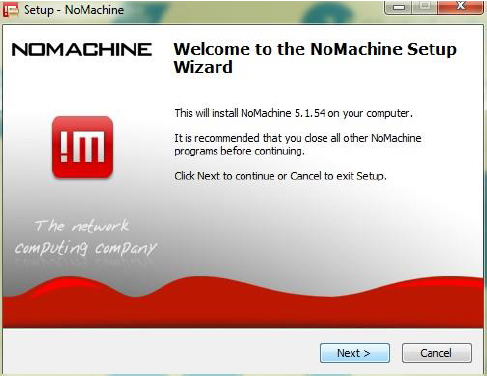{width="4.068589238845145in"
height="3.1496062992125986in"}

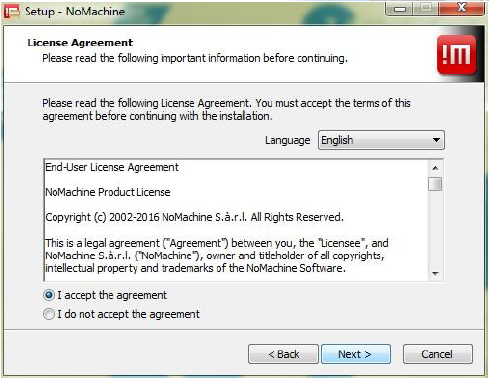{width="4.063740157480315in"
height="3.1496062992125986in"}

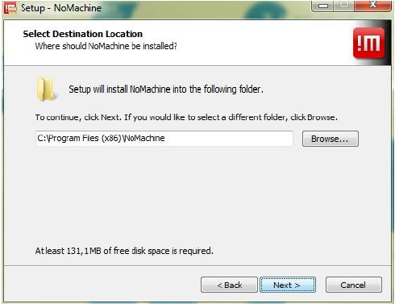{width="4.093652668416448in"
height="3.1496062992125986in"}

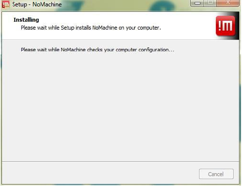{width="4.093652668416448in"
height="3.1496062992125986in"}

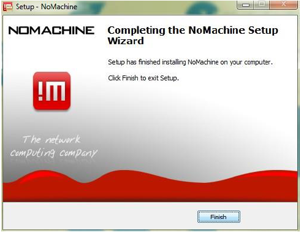{width="4.091154855643045in"
height="3.1496062992125986in"}

**\
**

**Step 4**: reboot your computer

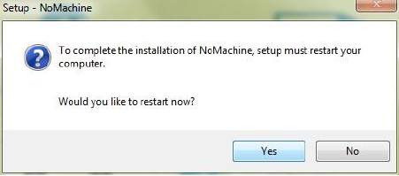{width="2.7559055118110236in"
height="1.2160203412073491in"}

**Step 5**: NoMachine client access configuration

**Step 5.1**: start 'NoMachine' and create a new connection

> {width="4.724409448818897in"
> height="3.0297101924759406in"}

**Step 5.2**: Choose 'NX protocol'

> 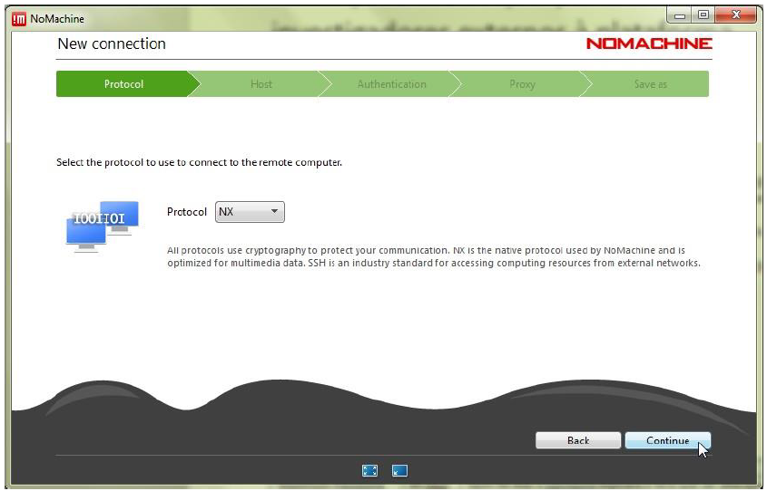{width="4.724409448818897in"
> height="3.0301957567804023in"}

**Step 5.3**: Define the 'Host' as bplimexterno.bportugal.pt, 'Port' 4000

> Click 'Use UDP communication for multimedia data'
>
> 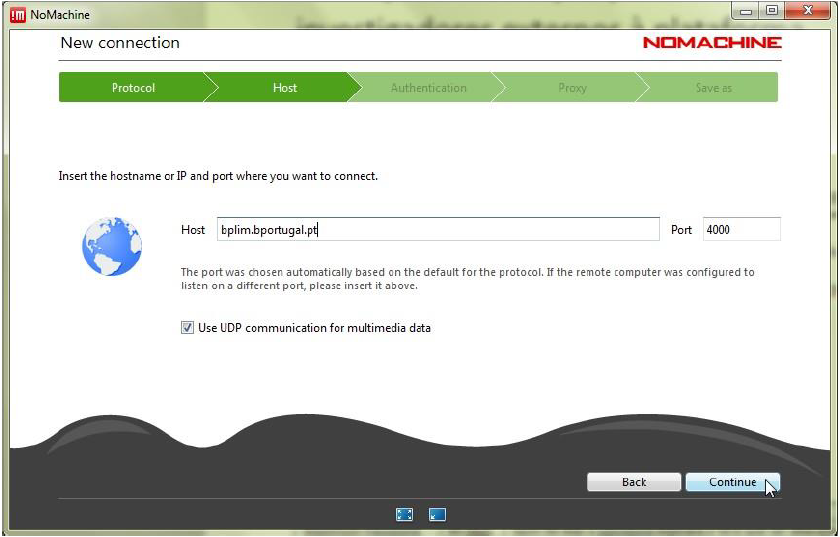{width="4.724409448818897in"
> height="3.0200164041994753in"}
>
> **Step 5.4**: Use password authentication, with or without proxy,
> depending on the instructions of the network administrator / user\'s
> computer support, with the name "BPLIM-LabInvestMicrodados Banco de
> Portugal".
>
> 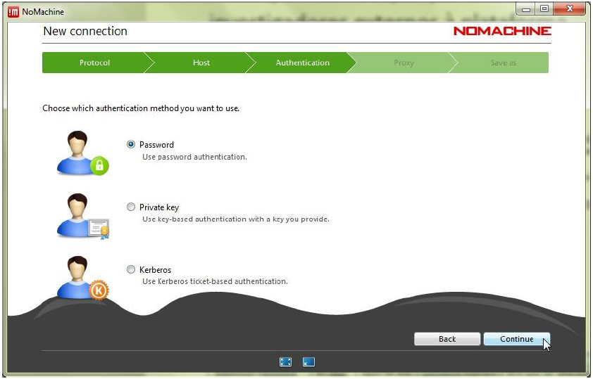{width="4.724409448818897in"
> height="3.024378827646544in"}
>
> **Step 5.5**: Do not use a 'proxy'
>
> 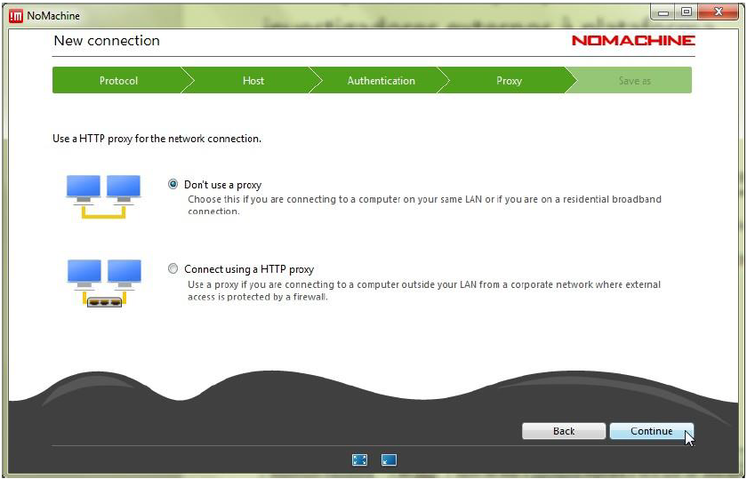{width="4.724409448818897in"
> height="3.0316502624671915in"}
>
> **Step 5.6**: Define a name for the connection
>
> 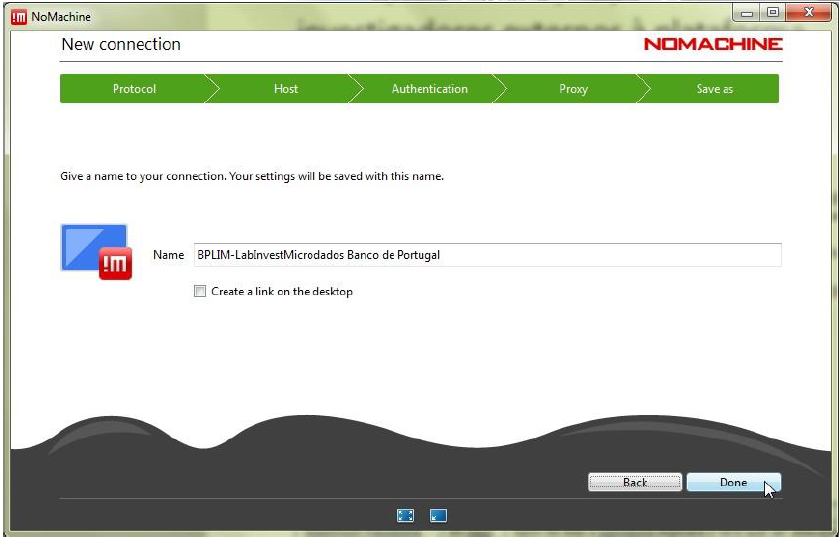{width="4.724409448818897in"
> height="3.0316502624671915in"}
>
> **Step 5.7**: Once the entry for bplimexterno.bportugal.pt has been created,
> connect:
>
> 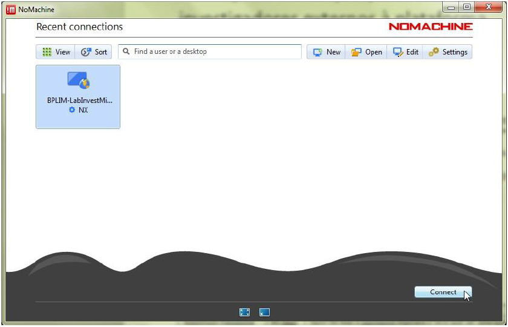{width="4.724409448818897in"
> height="3.036981627296588in"}

**\
**

> **Step 5.8**: Before the first effective connection it may be
> necessary to accept the certificate from bplimexterno.bportugal.pt
>
> The Investigator should verify that the \"fingerprint\" (verification
> code) is:
>
> **SHA256 ED 1B D9 E2 C2 F8 C6 08 1A 53 5F 97 DA 71 77 D9 D2 EE 7A 5F 9C 35 87 B3 19 F4 7E A1 CB 2C 68 0B**
>
> {width="4.724409448818897in"
> height="2.985113735783027in"}

**\
**

> **Step 5.9**: Connect with the UserID (**case sensitive**) and
> password provided by Banco de Portugal:
>
> 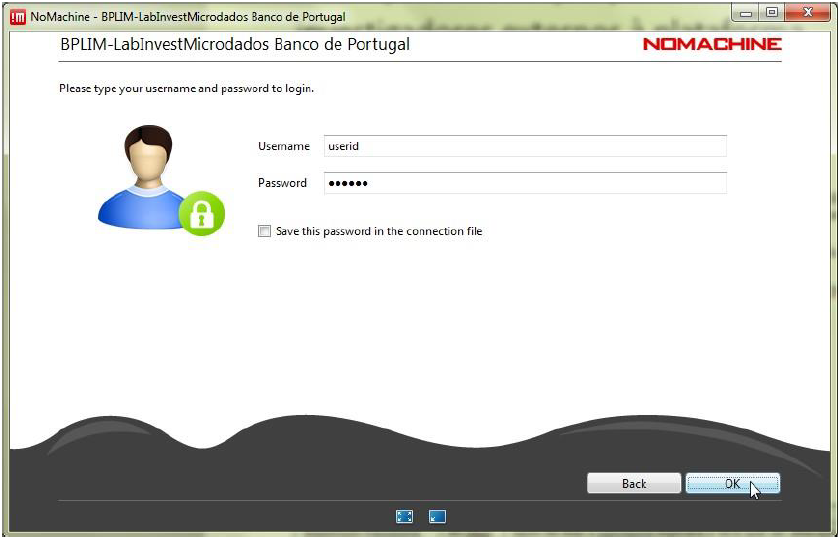{width="4.724409448818897in"
> height="3.0350426509186352in"}
>
> **Step 5.10**: After the first successful login, it is necessary to
> change the password, which must comply with the Password Policy
> defined above.
>
> If the new password does not comply with the Password Policy, the
> original password provided by the Banco de Portugal will be
> re-requested. See Appendix 3 for details.
>
> The NoMachine client does not tell you why the new password was not
> accepted -- it is the responsibility of the user to verify that the
> new password is in compliance.
>
> {width="4.724409448818897in"
> height="3.029721128608924in"}
>
> **Step 5.11**: Upon login success, the following screens should appear
>
> {width="4.724409448818897in"
> height="3.0297101924759406in"}
>
> 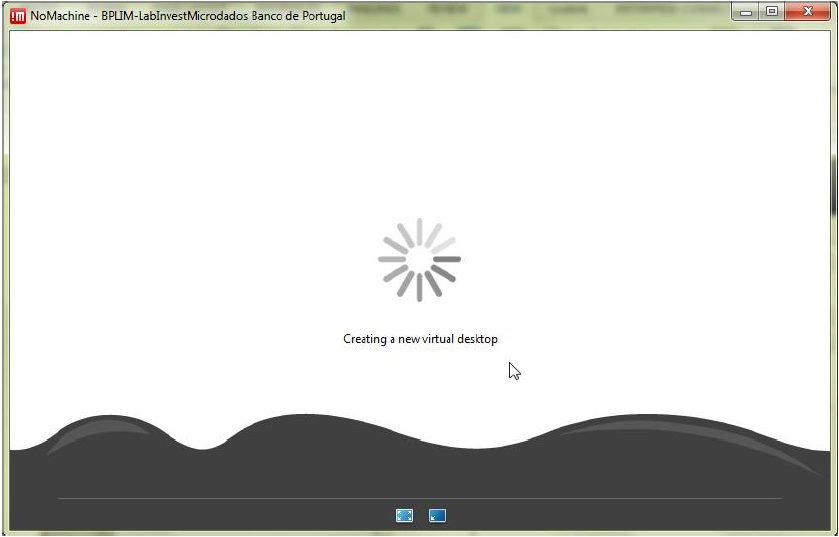{width="4.724409448818897in"
> height="3.0238943569553807in"}
>
> Once logged in and with access to a KDE session, click on the upper
> right corner of the KDE desktop, as shown below, to access the menu
> and then expand the screen as exemplified for greater ease of use.
>
> **Step 5.12**: You should see the following screen.
>
> {width="4.724409448818897in"
> height="3.0127438757655294in"}
>
> **Step 5.13**: Click 'Display'
>
> {width="4.724409448818897in"
> height="3.0268011811023623in"}
>
> **Step 5.14**: Click 'Fit to window' and click 'Done'
>
> 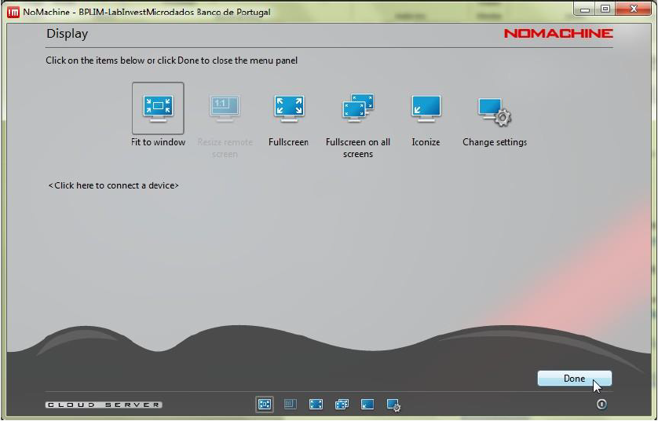{width="4.724409448818897in"
> height="3.0219542869641294in"}

Appendix 5 -- Browser access
============================

> Use a browser (recommended Chrome, Firefox, Opera or Safari) and go to

https://bplimexterno.bportugal.pt:4443

Below are the sequential screens you should see. In steps 4 to 7 you can define your settings.

> 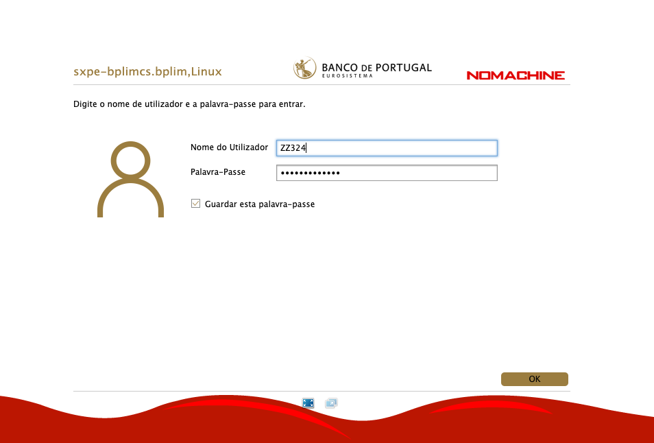{width="4.724409448818897in"
> height="3.26626968503937in"}

> 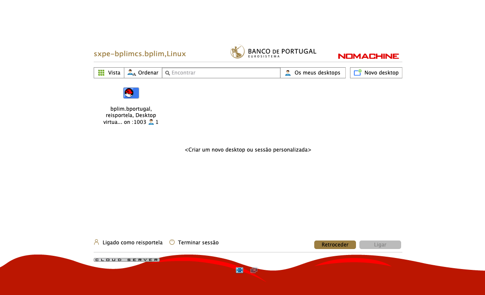{width="4.724409448818897in"
> height="3.26626968503937in"}

> {width="4.724409448818897in"
> height="3.26626968503937in"}

> {width="4.724409448818897in"
> height="3.26626968503937in"}

> 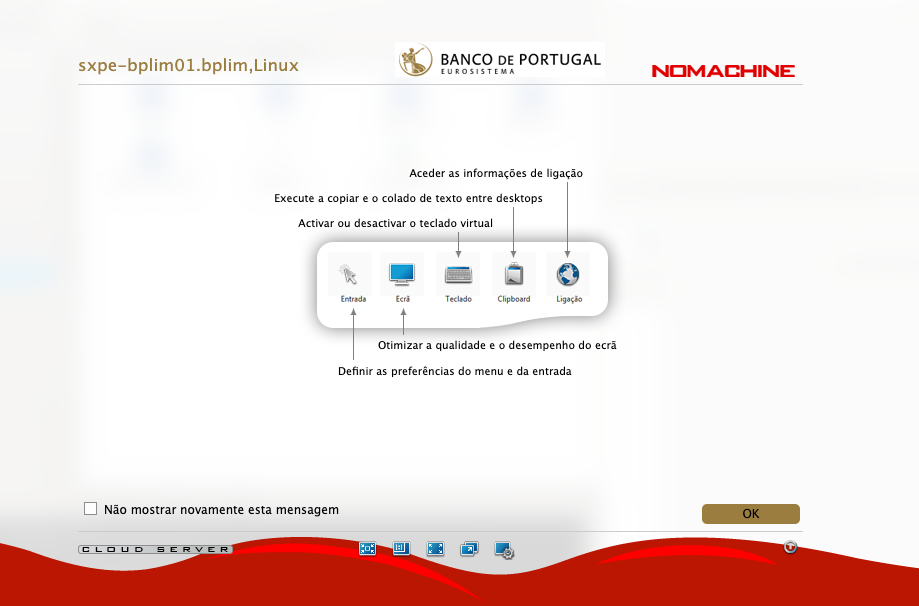{width="4.724409448818897in"
> height="3.26626968503937in"}

> 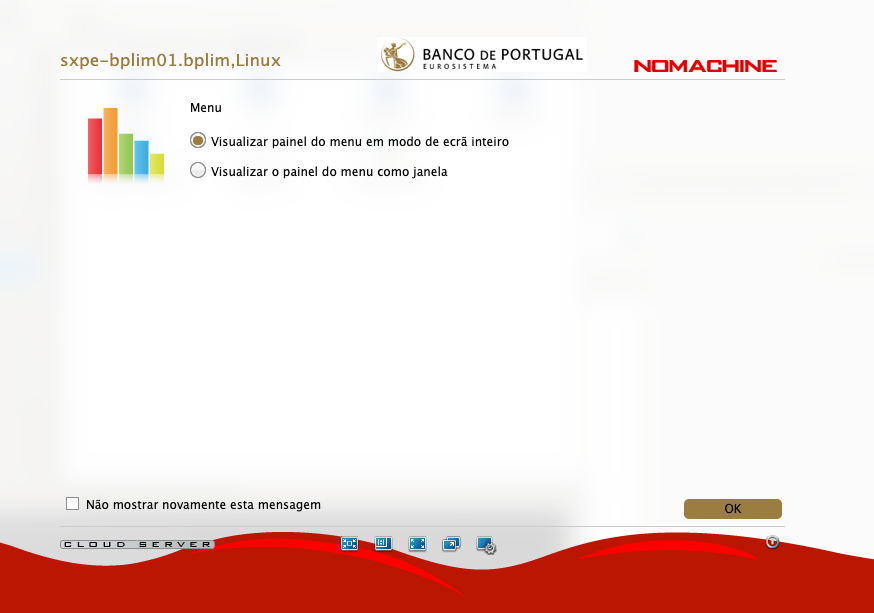{width="4.724409448818897in"
> height="3.26626968503937in"}

> 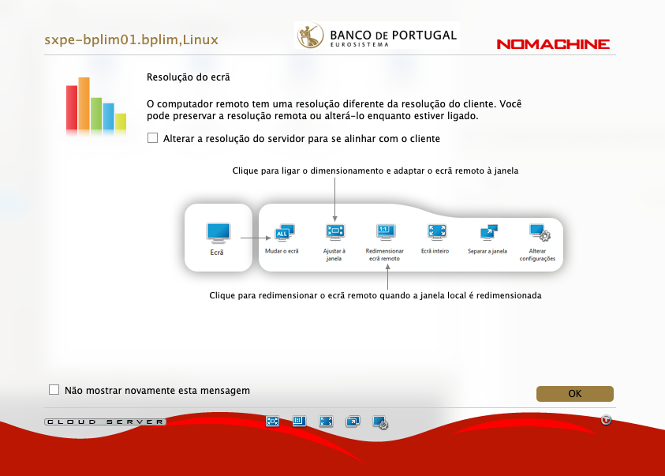{width="4.724409448818897in"
> height="3.26626968503937in"}

<!---
Configuring browser access

> To a large extent the configuration of the access via browser is
> similar to the configuration through the client NoMachine. However,
> the features and performance are lower than the "NoMachine client
> access".
>
> In case you are using a Portuguese Keyboard, note that the keyboard
> has to be set to Portuguese, as shown below, and even then some
> characters may have to be specified on the virtual keyboard (depending
> on the browser used). Please confirm the configuration of characters
> on your keyboard.
>
> 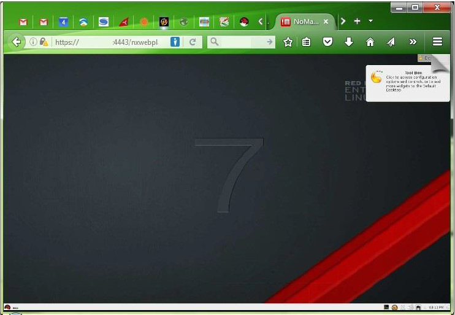{width="4.724409448818897in"
> height="3.26626968503937in"}
>
> {width="4.724409448818897in"
> height="3.8038615485564304in"}
>
> 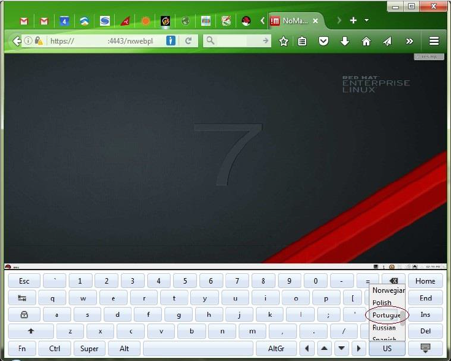{width="4.724409448818897in"
> height="3.779623797025372in"}
>
> 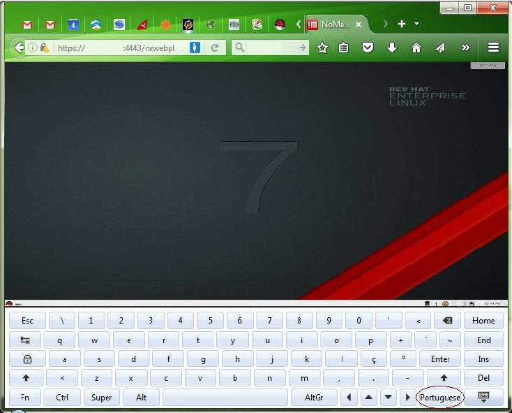{width="4.724409448818897in"
> height="3.8038615485564304in"}

-->

[Appendix 6 -- Frequently Asked Questions]{.underline}
======================================================

<!---
1.  After the login in "https://webfa.bportugal.pt" I am not able to
    download NoMachine's setup file

 It may occur that a firewall is preventing the download. We have
 verified such problem in some Universities and Governmental services.
 Please try the download outside the firewall
-->

1.  Mac users are not able to install NoMachine, receiving the following
    message

> {width="2.1653543307086616in"
> height="1.4969652230971129in"}

 Please check if your Mac OSX is updated. Temporary solution: download
 NoMachine Enterprise Client from the official website, and run the
 installation file:

 https://www.nomachine.com/download-enterprise\#NoMachine-Enterprise-Client

2.  NoMachine authentication failure

> {width="2.1653543307086616in"
> height="1.4077252843394576in"}

<!---
  - We have observed that some users who change their password within
    "https://webfa.bportugal.pt" later is not able to login within
    NoMachine (error message shown in the image above).
    -->
  - In some cases, it occurs due to a different keyboard layout. For example, if you have
    a Portuguese keyboard, but the website assumed a US keyboard, and
    your password contains a symbol like 'ç', than you will get a "wrong
    password" message. Please check the keyboard layout that is active
    when you type the password. Alternatively, change the password after
    the first login with NoMachine. Use linux's command 'passwd'.

  - Login fails and the system shows the message: \"Could not connect to
    the server. Error is 138: Connection is timed out\" Please check if
    your network has a strict firewall; e.g., some researchers are not
    able to reach BPLIM's server within their University network. Please
    check if in a different location, like at home, the connection
    works.

3.  User pressed 'Lock' instead of 'Log out' and the unlock/password
    does not work:

  - Check if the keyboard settings are correct (e.g., PT or UK)

  - Close the 'NoMachine' connection and start a new one. Before the
        last step -before the \'Login'- right click and choose 'Logout'.
        Double-click for the new connection

4.  "Cannot see the screen in NoMachine" (see image below)

> 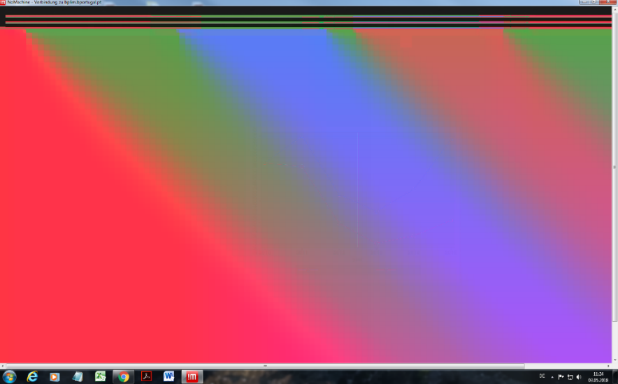{width="4.016666666666667in"
> height="2.4999496937882766in"}

5.  [OPTION A]{.underline}: move your mouse on top the upper right
    corner of NoMachine, you should see a "folded like sheet",
    left-click your mouse, go to 'Display', 'Change settings', and click
    in 'Disable client side hardware decoding'

{width="1.5652176290463693in" height="0.15in"}

6.  [OPTION B]{.underline}: Close the 'NoMachine' connection and start a
    new one. Before the last step -before the \'Login'- right click and
    choose 'Logout'. Double-click for the new connection

7.  "Error: Parameter 'agentm_display' has bad value" (see image below)

> {width="4.016666666666667in"
> height="2.4999496937882766in"}

  - Your home folder is full (/home/USER_LOGIN): **_Do not save files in your home folder_**

  - Ask BPLIM Staff to empty space in your home folder

8. Session if frozen

  - Go to NoMachine first screen and double click on the following icon

  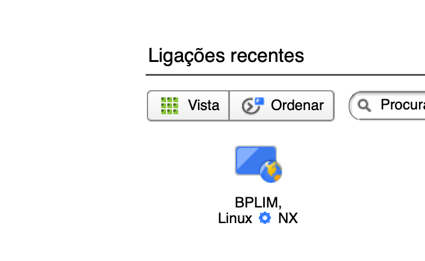{width="3in"}

  - right-click on the icon below and choose "Terminar sessão" 

  {width="3in"}

[^1]: Dolphin is an intuitive and easy-to-use file manager. You can use it, for example, to browse the directory, to
    create or to delete files/directories (by using the right mouse
    button). For more information about Dolphin, please visit:
    [https://userbase.kde.org/Dolphin](https://translate.google.com/translate?hl=en&prev=_t&sl=pt-BR&tl=en&u=https://userbase.kde.org/Dolphin)
    .

[^2]: In case 'xstata15mp.sh' does not launch Stata please see 'Section
    5.1.b'.

[^3]: Click on the cross button at the upper right corner to close.

[^4]: Note that before exiting the server, you need to make
    sure that all active programs have been closed (unless they have
    been launched in *batch* mode). Running programs in *batch* mode is justified for
    procedures that require high computational resources, intense
    calculation and / or long processing time.

[^5]: The '*shell'* supports the commands in Linux operating system
    (some are disabled).

[^6]: The version of Stata on the server has the same features as the
    Stata on Windows or Mac. By default when the Stata starts in this
    way the \"working directory\" active becomes your folder
    \"work\_area\".

[^7]: You may only remove text files that do not contain data or results
    that allow identification. For all the graphs you request as an
    output you must provide the corresponding Table to replicate it. You
    may only export graphs in .PNG format (no vector graph is allowed).