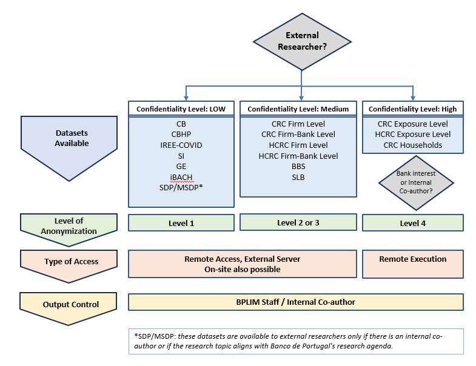
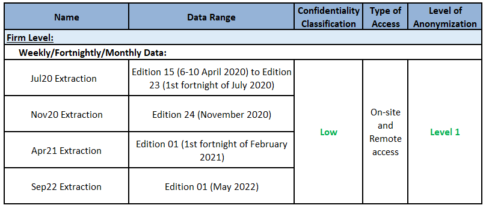
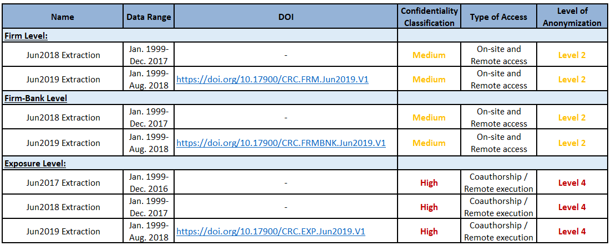
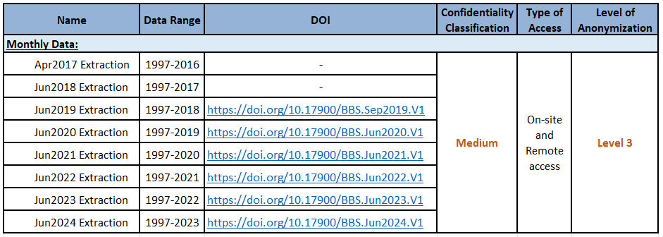



# General Remarks

This Guide describes the datasets available at BPLIM, both those **produced and owned by Banco de Portugal** (BdP) and those external databases that BPLIM has access to through **Protocols** established with various entities. 

This Guide is intended to complement the information provided in the [**Guide for Researchers**](https://github.com/BPLIM/Manuals/tree/master/Guides/01_Guide_for_Researchers), published by BPLIM, which describes the functioning of BPLIM, including the process of accessing data, types of anonymization, output control rules, among other topics. We **strongly recommend that researchers carefully read the Guide for Researchers** before proceeding with this Guide.

In section 3.5 of the Guide for Researchers, the different levels of anonymization that BPLIM uses are described. Briefly, BPLIM uses **four levels of anonymization**:

**Level 1**: All information that could lead to the direct identification of statistical units is omitted;

**Level 2**: In addition to Level 1, the values of variables containing sensitive information are replaced by modified values, which are random values that exhibit some correlation with the original values;

**Level 3**: In addition to Level 2, variables may be sorted randomly and independently to break the link between the observations.

**Level 4**: A subset of the data is generated randomly (pseudo-data), respecting only the metadata and the time structure of the original data.

The first part of the Guide outlines the datasets accessible to **External Researchers**, including a brief description of the data, their characteristics, the available time range, the Digital Object Identifier (DOI) when available, the confidentiality classification, the types of access available to external researchers, and the levels of anonymization applied.

The second part of the Guide details the additional datasets provided by BPLIM, which are primarily available to **Internal Researchers**. 

Lastly, the Guide highlights the datasets that BPLIM plans to make available in the near **future** for both internal and external researchers.



# Datasets Available for External Researchers

## Central Balance Sheet Database (CB)

The Central Balance Sheet Database is constructed and made available by BdP and provides **economic and financial information on non-financial corporations operating in Portugal**. It contains annual data from 2006 onwards and is mostly based on information reported through *Informação Empresarial Simplificada* (IES, Simplified Corporate Information). 

Until 2009, the data were reported according to the *Plano Oficial de Contabilidade* (POC, Official Chart of Accounts). In 2010, a new accounting system, the *Sistema de Normalização Contabilística* (SNC, Accounting Standards System) was put in place.
Thus, all data reported after 2009 follow the SNC. This is a structural change that is reflected in the way the dataset is organized and poses some challenges in the comparability of the variables over time.

BPLIM provides two different products: the annual firm-level set **(CB)** and the firm harmonized panel **(CBHP)**. CB contains the data as reported while CBHP contains variables that were made consistent over time. Besides these two products, any variable available at IES can be added on demand.

For more information on this dataset, please refer to the **Manuals and Auxiliary Documentation** (metadata files, variable descriptions) available in the [**BPLIM Github Repository - CB**](https://github.com/BPLIM/Manuals/tree/master/Data/CB).
 

(1) There are two variables that, if requested by an external researcher, will be anonymized at Level 2.



## Fast and Exceptional Enterprise Survey - COVID-19 (IREE-COVID)

The Fast and Exceptional Enterprise Survey - COVID-19 (IREE-COVID) was launched by Statistics Portugal (INE) and the BdP aiming to identify the main effects of the COVID-19 pandemic on key aspects of the enterprises activity, such as firm's turnover, workforce, prices, credit conditions and the use of Government support measures. This survey was addressed to a representative sample of non-financial firms located in Portugal. The data started being collected with a weekly frequency on April 6-10, 2020 and refers to a fortnight from May 2020 onwards. Although the survey was suspended after July 2020, two new editions were implemented, in November 2020 and in the first fortnight of February 2021 given the evolution of the pandemic situation. 

For more information on this dataset, please refer to the **Manuals and Auxiliary Documentation** (metadata files, variable descriptions) available in the [**BPLIM Github Repository - IREE**](https://github.com/BPLIM/Manuals/tree/master/Data/IREE).
 



## The Incentives Systems (SI)

The Incentives Systems Database (SI) includes information for projects submitted to the incentives systems funded by the European Regional Development Fund (ERDF) within the QREN (2007-2013) framework and the European Regional Development Fund and European Social Fund (ESF) within the PT2020 (2014-2020) framework. The data include information on both approved and non-approved applications. The data made available by BPLIM corresponds to a data freeze at a certain moment. The QREN data will no longer be subject to updates and corresponds to a freeze that occurred on September 2017. The PT2020 data is updated annually.

For more information on this dataset, please refer to the **Manuals and Auxiliary Documentation** (metadata files, variable descriptions) available in the [**BPLIM Github Repository - SI**](https://github.com/BPLIM/Manuals/tree/master/Data/SI).
 

## Entreprise Groups (GE)

The Enterprise Groups Database (GE) is constructed and made available by BdP and provides information on the participations in equity capital and voting rights of non-financial corporations operating in Portugal. This dataset contains annual data from 2014 onwards and is based on the information reported through Informação Empresarial Simplificada (IES, Simplified Corporate Information).

For more information on this dataset, please refer to the **Manuals and Auxiliary Documentation** (metadata files, variable descriptions) available in the [**BPLIM Github Repository - GE**](https://github.com/BPLIM/Manuals/tree/master/Data/GEXXXXX).
 



## Spanish and Portuguese Companies Microdata (iBACH)

The Spanish and Portuguese Companies Microdata (iBACH) contains economic and financial granular information on non-financial Spanish and Portuguese corporations from iBACH. This dataset derives from BACH dataset. BACH is a database of aggregated and harmonized accounting data of non-financial companies, based on national accounting standards (individual annual accounts). 

This dataset is also made available by the [**Data Laboratory of the Banco de España - BELab**](https://www.bde.es/wbe/en/para-ciudadano/servicios/belab/contenido/microdatos-disponibles/microdatos-de-empresas-espanolas-y-portuguesas--ibach-.html).

For more information on this dataset, please refer to the **Manuals and Auxiliary Documentation** (metadata files, variable descriptions) available in the [**BPLIM Github Repository - iBACH**](https://github.com/BPLIM/Manuals/tree/master/Data/iBACH).
 



## Central Credit Register Database (CRC)

The Central Credit Register (CRC) database reports credit supply by all credit-granting institutions in Portugal. Data is collected monthly with the objective of supporting participants in the risk assessment of credit concession. Until 2018, Banco de Portugal collected information at the **credit exposure level** and produced three datasets with different levels of granularity: **exposure-level**, **firm-bank-level** and **firm-level** data (this database is now known as the Old CRC). This database was updated annually until 2018. Old CRC underwent a major revision in September, 2018 and was replaced by a new reporting system.

For more information on this dataset, please refer to the **Manuals and Auxiliary Documentation** (metadata files, variable descriptions) available in the [**BPLIM Github Repository - CRC**](https://github.com/BPLIM/Manuals/tree/master/Data/CRC).
 



## Harmonized Central Credit Register (HCRC)

The Portuguese Central Credit Register (with the database prior to September 2018 known as the Old CRC) underwent a major revision in September, 2018 and was replaced by a new reporting system (known as the New CRC), which started to collect granular credit data at the **instrument level**.

The Harmonized Central Credit Register Database (HCRC) aims to build compatible series between the Old CRC and the New CRC by selecting a set of most relevant variables and adopting necessary steps to harmonize the data. The database is updated annually, covers the period from 2009 onwards and consists of information aggregated at the **firm-level** and **bank-firm level**. 
Data constructed at **exposure level** mimicking the data structure of the Old CRC is only available to internal researchers.

For more information on this dataset, please refer to the **Manuals and Auxiliary Documentation** (metadata files, variable descriptions) available in the [**BPLIM Github Repository - HCRC**](https://github.com/BPLIM/Manuals/tree/master/Data/HCRC).
 



## Bank Balance Sheet (BBS)

The Monetary Financial Institutions (MFIs) Balance Sheet Database (BBS) reports, on a **individual basis**, detailed information on the assets and liabilities of the MFIs operating in Portugal. The dataset contains monthly data, from 1997 onwards and is updated annually. 

For more information on this dataset, please refer to the **Manuals and Auxiliary Documentation** (metadata files, variable descriptions) available in the [**BPLIM Github Repository - BBS**](https://github.com/BPLIM/Manuals/tree/master/Data/BBS).
 



## Historical Series of Portuguese Banking Sector (SLB)

The Historical Series of the Portuguese Banking Sector Database (SLB) reports, on a **consolidated basis**, a wide range of series on bank's financial statements (i.e., balance sheet, income statement, and solvency), loans to customers, interest rates, human resources, branch network, and payment systems. The data is collected and assembled by a working group at BdP, which was established at the end of 2017 with the objective of constructing historical series on the Portuguese banking sector.

The SLB database covers the period from 1990 onwards and is available at yearly frequency. For some tables (i.e., balance sheet, income statement, solvency, loans to customers, and interest rates), data is also available at quarterly frequency. This dataset is updated annually. 

For more information on this dataset, please refer to the **Manuals and Auxiliary Documentation** (metadata files, variable descriptions) available in the [**BPLIM Github Repository - SLB**](https://github.com/BPLIM/Manuals/tree/master/Data/SLB).
 



## Summary



# Additional Datasets Available for Internal Researchers

Although these datasets are primarily available for internal use, all datasets produced by the Bank of Portugal can be made available to **external researchers** through **remote execution**, provided that the project’s research topic is considered relevant to the Bank of Portugal’s **research agenda**.

## Central Credit Register (CRC) - Households

The Central Credit Register (CRC) database contains credit exposure data for both firms and **households**. Data on credit granted to households is only available for Internal Researchers. This information is considered **highly confidential** due to its sensitive nature. 

## Supermarket Daily Prices (SDP) and Matched Supermarket Daily Prices (MSDP)

The Supermarket Daily Prices (SDP) database provides **daily data on the prices** of food and beverage products sold in six supermarkets in Portugal: Auchan, Continente, Minipreço, Pingo Doce, Froiz, and Supercor. This information is **webscraped** from their online stores by BPLIM. 

Using this data, BPLIM created the Matched Supermarket Daily Prices (MSDP), which offers daily data on the prices of food and beverage products sold across multiple supermarkets included in the SDP database. This enables **price comparisons** across different supermarkets. 

Both the SDP and MSDP datsets cover the period starting in 2021 and are updated **annually for research purposes**. 

This data can only be used for research projects involving Internal Researchers. 



# Future Developments

## Statistical Central Credit Register (SCRC)

The Portuguese Central Credit Register (with the database prior to August 2018 known as the Old CRC) underwent a major revision in September, 2018 and was replaced by a new reporting system (i.e. NEWCRC) which started to collect granular credit data on a loan-by-loan basis.

To **facilitate and harmonize** the use of credit information, the Statistical Central Credit Register (Statistical CRC) was created. This database contains credit information at the micro level, where information reported to the CRC is made available after statistical data processing processes. These processes include the correction of flaws identified in the reported information and the calculation of additional variables following harmonized algorithms. 

As a result, the Statistical CRC guarantees the existence of a common base of granular information on credit so that analyses made from this database are consistent with each other.

The data will be available at the **firm level**, **firm-bank level**, and **instrument level**.

## Balance of Payments (BoP)

The Portuguese Balance of Payments records the transactions that take place between residents and non-residents in Portugal over a given period of time, typically a month, quarter, or year. Transactions are classified in the balance of payments according to the nature of the underlying economic resources. There are **three main categories**: **current account**, **capital account**, and **financial account**.

The current account includes transactions between residents and non-residents involving produced assets (goods and services), primary income (income from the use of factors of production such as capital and labor), and secondary income (current transfers).

## E-Fatura

E-Fatura data is received monthly under a **Protocol** signed between BdP and INE. This database contains **information regarding invoices** issued by entities that have their headquarters or permanent establishment in the national territory. The information is aggregated by the tax identification number (NIF) of the issuer (only for legal persons) and the acquirer. 

INE implements some data cleaning, like imputation of missings or outliers, before sharing the data with BdP.

This data will only be available to Internal Researchers. 

## Social Security (SS)

Social Security Data (SS) is received every month under a **Protocol** signed between BdP and Social Security Institute and may only be used by Internal Researchers.

It provides monthly information on the classification of the individual for contribution purposes, wage registers, Social Security transfers, and pensions since January 2010. Information on pensions is also available since January 2017.

This data will only be available to Internal Researchers. 

## Institute for Employment and Vocational Training Database (IEFP)

IEFP data encompasses all job applications, job offers, applications to job offers, interventions, and calls managed by the Institute for Employment and Vocational Training's information system.

This dataset tracks individuals who register with IEFP for job searching purposes, detailing their interventions, calls received from job centers, and job applications submitted. It also provides insights into the outcomes of these interventions, calls, and applications.

This data will only be available to Internal Researchers. 

