<!---

1. open TERMINAL
2. RUN THE FOLLOWING LINE IN THE TERMINAL

pandoc --toc --number-sections External_Server_Guide.md --pdf-engine=xelatex -o External_Server_Guide.pdf

pandoc External_Server_Guide.md --pdf-engine=xelatex --toc --number-sections -V documentclass=scrartcl -V toc-title=Contents -V geometry:top=27mm -V geometry:bottom=27mm -V geometry:left=27mm -V geometry:right=27mm -V colorlinks=true -V linkcolor=blue -V urlcolor=blue -V citecolor=blue -o External_Server_Guide.pdf


ALTERNATIVE

https://marketplace.visualstudio.com/items?itemName=yzane.markdown-pdf

-->

<!---

About BPLIM
=========================

The ability to collect and accumulate microdata has been a powerful
function of central banks. In the scientific community, an increasing
number of research has been conducted using the micro-level
information. To enhance collaborations between the central bank and researchers, an advanced data-sharing platform is essential.
Accordingly, the Banco de Portugal Microdata Research Laboratory
(BPLIM) (*Laboratório de Investigação em Microdados do Banco de
Portugal*) is created to facilitate future scientific research effort
that incorporates the use of microdata. By eliminating the data access
barrier, BPLIM aims to inspire researches that effectively utilize the
Portuguese administrative micro datasets and contribute to our
understanding of the economic and financial challenges of our time.

Data Confidentiality
==================================

While researchers prefer unrestricted access to data, care must be
given to secure the confidentiality of the data providers. All the access
granted to microdata should obey the applicable law, and the data
should only be used for research purposes.

Therefore, the data is only made available to the Banco de Portugal's
internal researchers and those approved external researchers who have
agreed to the bank's legal provisions concerning the use of its data.
Specifically, each external researcher is required to sign a
Confidentiality Agreement with the bank and will only be allowed to
access a customized set of data that is tailored to his/her research
needs. All micro data sets made accessible to external researchers
will be anonymized and stored in information systems belonging to
Banco de Portugal (BdP).

The type of access to the Microdata varies according to levels of
confidentiality (low, medium, high).

-   **Low**: information that can be obtained from the public or
    scientific community by other institutions

-   **Medium**: information pertaining to institutions (firms, banks,
    etc.) not included in the previous case (some CB, CRC Firms, Bank
    Balance Sheet Data).

-   **High**: information about individuals or households not included
    in the **Low** case (CRC Individuals).

-->

<!--=========================================== --->

<!---
\newpage
-->


# Access to the External Server

## Overview

This guide will help you connect to BPLIM's external server, navigate your project environment, and use statistical software (Stata, R, Python, Julia) for your research. The server runs on Linux and uses containerized environments to ensure reproducibility and consistency across projects.

**Key features:**

- Secure remote access via NoMachine client
- Isolated project environments with defined folder structures
- Statistical software running in containers
- Support for interactive and batch processing modes

## Upon Access Approval

Once access is approved, you can connect to the external server using the **NoMachine** client.
See [Download, install and configure NoMachine client](#install_nomachine) for detailed instructions.

---

## Password Policy

Passwords are a critical security component. Your initial password must be changed at first login, and all passwords must comply with the requirements below.

**Password requirements:**

- **Minimum length:** 8 characters
- **Character classes:** At least 4 different types (uppercase, lowercase, numbers, punctuation)
- **History:** Cannot reuse any of your last 7 passwords
- **Expiration:** Passwords expire after 60 days and must be changed at next login
- **Failed attempts:** After 6 consecutive failed login attempts, your account will be locked for 10 minutes

For complete password policy details, see [Appendix: Password Requirements](#password)


## First Steps

This section guides you through your initial login and introduces the basic interface and folder structure.

### Logging In

1. When you start **NoMachine**, you will see the following connection screens:

>

> {width=65%}

>

> {width=65%}

>

> {width=65%}

>

### Accessing Your Project

2. Once logged in, select the **Kickoff Application Launcher** menu:

>

> {width=10%}

>

> 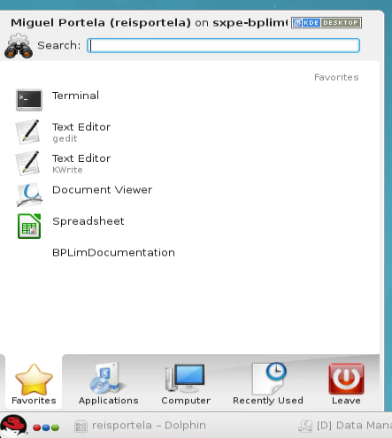{width=50%}

>

3. Navigate to your project:

   1. Click on **Applications**.

   2. Select **BPLIM** and click on your project (e.g., `P999_research_project`).

      This opens the **Dolphin** file manager[^1], showing your project folder:

>

> {width=50%}

>

 You can display the Terminal (command line) alongside Dolphin by pressing **F4**.

### Understanding Your Project Structure

4. **Launcher scripts**: Files with the `.sh` extension are scripts that launch applications or enter containerized environments. For example, `stata_container.sh` starts Stata.[^9]

   You can run launcher scripts in two ways:

   - **GUI method:** Double-click the `.sh` file in Dolphin
   - **Terminal method:** Type `./stata_container.sh` in the Terminal

5. **Project folders**: Your project folder contains the following directories:

| Directory              | Purpose                               | Access     |
|------------------------|---------------------------------------|------------|
| `initial_dataset`      | Data sources provided by BPLIM        | Read-only  |
| --- `external`         | Data provided by the researcher       | Read-only  |
| --- `intermediate`     | Intermediate files                    | Read-only  |
| --- `modified`         | Modified data provided by BPLIM       | Read-only  |
| `results`              | Output files generated by researchers | Read-write |
| `tools`                | Project-specific analysis tools       | Read-only  |
| `work_area`            | Temporary working directory           | Read-write |

   **Note:** Your `work_area` folder also contains templates for Stata and R. By default, these template files are read-only.

### Logging Out

6. To properly disconnect, log out as shown below, then close the NoMachine window:[^3]

>

> {width=50%}

>

   Confirm by clicking **Logout**:[^4]

>

> {width=25%}

>

**Important notes about session management:**

- **Persistent sessions:** If you do not log out, your session remains open until your next login. While this keeps programs running, it consumes server resources.

- **Best practice for long-running tasks:** Use **batch mode** (see [Running Programs in Batch Mode](#batch-mode)) instead of leaving sessions open.

- **Server maintenance:** During server reboots, open sessions are terminated and unsaved work is lost. Save your work regularly.


# Important Guidelines

## Managing Disk Space

Proper disk space management is essential for maintaining access to the server.

### Critical Rule: Do Not Save Files in Your Home Folder

**Never save files in your home folder** (`/home/USER_LOGIN`).
If you exceed its size limit, you will not be able to log in. Always save files in your project's `work_area` folder.

### Monitoring and Cleaning Your Project Folder

Check your project size regularly to avoid exceeding storage limits. Follow these steps in the Terminal:

1. Navigate to your project folder:

   ```bash
   cd /bplimext/projects/P999_research_project/
   ```

2. List the total project size:

   ```bash
   du -h
   ```

3. Check folder sizes and list those larger than or equal to 1 GB:

   ```bash
   du --max-depth=1 -h | sort -h | grep G
   ```

4. Move to the `work_area` folder:

   ```bash
   cd work_area
   ```

5. Repeat the size check in this folder:

   ```bash
   du --max-depth=1 -h | sort -h | grep G
   ```

6. Identify duplicate or temporary files and remove them:

   ```bash
   rm FILE_TO_DELETE
   ```

7. Compress large files or folders you are not currently using:

   - Compress a folder:

     ```bash
     tar -zcvf YOUR_FOLDER.tar.gz YOUR_FOLDER
     ```

   - Compress an individual file:

     ```bash
     gzip YOUR_FILE
     ```


## Using the Terminal

The Terminal is a command-line interface for interacting with the Linux system. It is essential for running programs in batch mode, managing files, and monitoring processes.

### Accessing the Terminal

You can access the Terminal in two ways:

- **From the menu:** Red Hat → Applications → System → Terminal

>

> {width=50%}

>

- **From Dolphin:** Press **F4** to open an integrated Terminal at the current location

### Essential Terminal Tips

**Quick reference:**

1. **Case sensitivity:** Linux commands are case-sensitive (`ls` is not the same as `LS`)

2. **Command history:** Use arrow keys (up/down) to scroll through previous commands

3. **Auto-completion:** Press **Tab** to auto-complete file names and commands

4. **Keyboard layouts:** Non-English keyboards may have different symbol mappings. For example, on a Portuguese keyboard, `+` is on the `?` key

5. **Common commands:** See [Appendix: Shell Commands](#shell_commands) for a comprehensive list

**Example command:**

   ```bash
   ls -lArth
   ```

   Lists files in human-readable format (`h`), long format (`l`), reverse order (`r`), sorted by modification time (`t`), including hidden files (`A`)

\newpage


# Working with Containers

All statistical software on the server runs inside **containers** -- isolated, self-contained environments that ensure reproducibility and consistency.[^9] Understanding how to work with containers is essential before using any statistical software.

## What Are Containers?

A container is a self-contained environment that includes a program along with all its dependencies, libraries, and configurations. This ensures:

- **Consistency:** Programs behave identically across different sessions
- **Reproducibility:** Your analysis can be replicated exactly
- **Isolation:** Project-specific packages don't conflict with other projects

## Starting Containers

There are three ways to start a container:

### Method 1: Using Launcher Scripts (Recommended)

Each project includes launcher scripts (`.sh` files) for different software:

- `stata_container.sh` - Launches Stata
- `r_container.sh` - Launches R/RStudio
- `python_container.sh` - Launches Python/Jupyter
- `julia_container.sh` - Launches Julia

**To use:** Double-click the script in Dolphin or run `./script_name.sh` in the Terminal.

### Method 2: From the Terminal

```bash
cd /bplimext/projects/P999_research_project
singularity shell tools/_container/CONTAINER_ID.sif
```

After entering the container, the Terminal prompt changes to show `Singularity>`. You can then launch applications manually.

### Method 3: Direct Execution

Run commands directly inside the container without entering an interactive shell:

```bash
singularity exec tools/_container/CONTAINER_ID.sif <command>
```

**When to use each method:**

- **Method 1:** Best for interactive work with graphical interfaces
- **Method 2:** Good for running multiple commands or programs within the same container session
- **Method 3:** Ideal for batch processing and automated scripts


# Statistical Software {#statistical_software}

This section covers how to use Stata, R, Python, and Julia on the server. All software runs inside containers (see [Working with Containers](#working-with-containers) above).

## Stata

### Starting Stata

Use the `stata_container.sh` launcher script in your project folder:

- **GUI method:** Double-click `stata_container.sh` in Dolphin
- **Terminal method:** Run `./stata_container.sh` from your project folder

**Manual container access:**

If you need to manually access the Stata container:

```bash
cd /bplimext/projects/P999_research_project
singularity shell tools/_container/CONTAINER_ID.sif
```

Then launch Stata:

- **Graphical version:** `xstata-mp`
- **Command-line version:** `stata-mp`

### Ado-files

Ado-files are text files containing Stata programs. It is advisable to create and save your ado-files so results can be replicated later when running them on BPLIM datasets.

Stata looks for ado-files in several locations, typically organized as:

- **SITE** – system-wide ado-files

- **PLUS** – user-installed ado-files

- **PERSONAL** – user-created ado-files

- **OLDPLACE** – legacy location for ado-files


Ado-files created for your project can be found in the current directory (`.`). Specific ado-files requested from BPLIM will be placed in `/bplimext/projects/P999_research_project/tools`.
To make sure Stata recognizes this directory, add the following line at the beginning of your `.do` file:

```stata
adopath + "/bplimext/projects/P999_research_project/tools"
```

The `sysdir` command within Stata will list all directories currently in use:

>

> 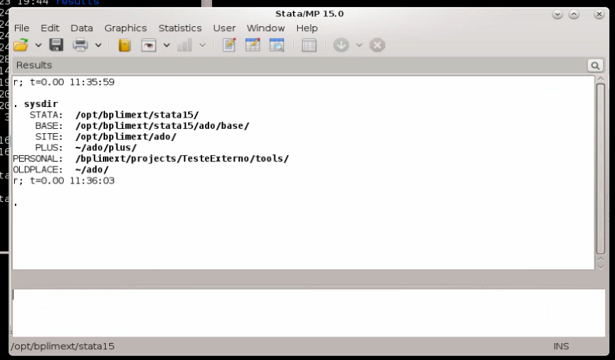{width=50%}

>

### Temporary Files

To manage Stata's temporary files:

1. Check the current temporary folder:

   ```stata
   tempfile junk
   display "`junk'"
   ```

2. It should display something like `/tmp/St98278.000001`

3. If the temporary file is not in the path `/tmp`, exit Stata and edit your `.bashrc` in your home directory (`cd ~`) with `kwrite` or `vi` and add:

   ```bash
   export STATATMP="/tmp"
   ```

4. Apply the changes:

   ```bash
   source .bashrc
   ```

5. Start a new Stata session (inside the container).


### Running Stata in Batch Mode {#stata-batch}

Batch mode is the recommended method for long-running or computationally intensive programs. For general information about batch processing, see [Running Programs in Batch Mode](#batch-mode).

**Stata-specific steps:**

1. Navigate to the folder containing your do-file (e.g., `prog1.do`):

   ```bash
   cd /bplimext/projects/P999_research_project/work_area/
   ```

   **Tip:** Use Dolphin to navigate, then press **F4** to open a Terminal at that location.

2. Create a batch script file (plain text) named, for example, `batch_prog1`.

3. In this file, write the command to execute your do-file:

   ```bash
   stata-mp do /bplimext/projects/P999_research_project/work_area/prog1.do
   ```

4. Create the batch file using a text editor:

   - **Command-line editor:** `vi batch_prog1`
   - **Graphical editors:** KWrite or Stata Do-file Editor

>

> {width=50%}

>

   **Tip:** Adding a `.txt` extension (e.g., `batch_prog1.txt`) can help some editors recognize the file.

5. Enter the container environment and submit the batch job:

   ```bash
   singularity shell ../tools/_container/CONTAINER_ID.sif
   at now -f batch_prog1
   ```

6. Monitor your program using `top` or check the log file:

   ```bash
   tail -f prog1.log
   ```

For detailed information on batch processing, monitoring, and troubleshooting, see the [Running Programs in Batch Mode](#batch-mode) section.

### Running Stata with Screen

To run Stata interactively while preserving your session if the connection drops, use `screen`. See [Using Screen for Persistent Sessions](#screen-sessions) for detailed instructions.


## R

### Starting R/RStudio

Use the `r_container.sh` launcher script in your project folder:

- **GUI method:** Double-click `r_container.sh` in Dolphin
- **Terminal method:** Run `./r_container.sh` from your project folder

This launches RStudio inside the container environment.

**Manual container access:**

If you need to manually access the R container:

```bash
cd /bplimext/projects/P999_research_project
singularity shell tools/_container/CONTAINER_ID.sif
rstudio
```

**IMPORTANT:** When exiting R, do **not** save your workspace image to your home folder. If you need to preserve your workspace, save it in your project's `work_area` folder.


### Running R in Batch Mode {#r-batch}

Batch mode is recommended for long-running R scripts. For general information about batch processing, see [Running Programs in Batch Mode](#batch-mode).

**R-specific steps:**

1. Navigate to the folder containing your R script (e.g., `analysis.R`):

   ```bash
   cd /bplimext/projects/P999_research_project/work_area/
   ```

2. Create a batch script file named, for example, `batch_r_analysis`:

   ```bash
   Rscript /bplimext/projects/P999_research_project/work_area/analysis.R /
   > analysis.log 2>&1
   ```

   The `> analysis.log 2>&1` redirects both output and errors to a log file.

3. Create the file using `vi`, `kwrite`, or any text editor:

   ```bash
   vi batch_r_analysis
   ```

4. Enter the container environment and submit the batch job:

   ```bash
   singularity shell tools/_container/CONTAINER_ID.sif
   at now -f batch_r_analysis
   ```

5. Monitor your program:

   ```bash
   tail -f analysis.log
   ```

For detailed information on batch processing, see the [Running Programs in Batch Mode](#batch-mode) section.

### Running R with Screen

To run R interactively while preserving your session, use `screen`. See [Using Screen for Persistent Sessions](#screen-sessions) for detailed instructions.


## Python

**Starting Python/Jupyter**

Use the `python_container.sh` launcher script in your project folder:

- **GUI method:** Double-click `python_container.sh` in Dolphin
- **Terminal method:** Run `./python_container.sh` from your project folder

**Manual container access:**

```bash
cd /bplimext/projects/P999_research_project
singularity shell tools/_container/CONTAINER_ID.sif
```

Once inside the container, launch Jupyter Notebook:

```bash
jupyter notebook
```

This opens Jupyter in Firefox. Click **New** and select the **Python** kernel to create a notebook.

You can also use VSCode:

```bash
code
```


## Julia

**Starting Julia**

Use the `julia_container.sh` launcher script in your project folder:

- **GUI method:** Double-click `julia_container.sh` in Dolphin
- **Terminal method:** Run `./julia_container.sh` from your project folder

**Manual container access:**

```bash
cd /bplimext/projects/P999_research_project
singularity shell tools/_container/CONTAINER_ID.sif
```

Once inside the container, you can launch:

- **Julia REPL:** `julia`
- **Jupyter Notebook:** `jupyter notebook` (opens in Firefox; select the Julia kernel)
- **VS Code:** `code` (opens VS Code for Julia development)


## Updates to Commands and Packages

Requests for additional commands or packages, as well as updates to existing ones, must be submitted to the **BPLIM Team**.


## Build a Container to Fine-Tune Your Statistical Packages

The server uses **Apptainer (formerly Singularity)** containers. To request one, please send the BPLIM Team the **definition file**. We will build the image and place it in your project's `tools`. Detailed information about Apptainer/Singularity containers is available at [https://sylabs.io/](https://sylabs.io/).[^8] Additional notes are provided in the Appendix.


# Running Programs in Batch Mode {#batch-mode}

Batch mode is the **recommended method** for running long-running or computationally intensive programs. Instead of keeping an interactive session open, batch mode allows you to submit jobs that run in the background.

## Why Use Batch Mode?

- **Efficiency:** Frees up your interactive session
- **Reliability:** Programs continue running even if you disconnect
- **Resource management:** Better server performance for all users
- **Recommended for:** Any program that runs longer than 30 minutes

## Basic Batch Workflow

1. **Navigate to your working folder:**

   ```bash
   cd /bplimext/projects/P999_research_project/work_area/
   ```

2. **Create a batch script file** (plain text) containing the command to execute:

   Example for Stata (`batch_prog1`):

   ```bash
   stata-mp do /bplimext/projects/P999_research_project/work_area/prog1.do
   ```

   Example for R (`batch_r_analysis`):

   ```bash
   Rscript /bplimext/projects/P999_research_project/work_area/analysis.R /
     analysis.log 2>&1
   ```

3. **Enter the container environment:**

   ```bash
   singularity shell ../tools/_container/CONTAINER_ID.sif
   ```

4. **Submit the batch job:**

   ```bash
   at now -f batch_prog1
   ```

## Scheduling Jobs

The `at` command allows you to schedule jobs:

- **Run immediately:** `at now -f batch_script`
- **Run in 5 hours:** `at now + 5 hours -f batch_script`
- **Run in 30 minutes:** `at now + 30 minutes -f batch_script`

For more options, type `man at` in the Terminal.

## Managing Batch Jobs

**View queued/running jobs:**

```bash
atq
```

- `=` indicates the job is currently running
- `a` indicates the job is queued with its scheduled time

**Remove a job from the queue:**

```bash
atrm <job_number>
```

## Monitoring Running Programs

### Using `top`

```bash
top
```

- Press `i` to hide background processes
- Press `k` to kill a process (enter PID, then type `9` to force termination)
- Press `q` to exit

### Using `tail` to monitor log files

```bash
tail -f logfile.log
```

This continuously displays new lines as they are written. Press `CTRL + C` to stop monitoring.


# Using Screen for Persistent Sessions {#screen-sessions}

`screen` is a session manager that allows you to run programs interactively while preserving your session if your network connection drops.

## Basic Screen Usage

**Start a new screen session:**

```bash
screen -S my_session_name
```

**Detach from a screen session** (keeps it running):

Press `CTRL + A`, then `D`

**List all running screen sessions:**

```bash
screen -ls
```

**Reattach to a screen session:**

```bash
screen -r my_session_name
```

Or, if only one session exists:

```bash
screen -r
```

**Reattach to a specific session by PID:**

```bash
screen -r <pid>
```

## Example: Running Stata with Screen

```bash
screen -S stata_session
singularity shell tools/_container/CONTAINER_ID.sif
stata-mp
```

To detach: Press `CTRL + A`, then `D`

To return later: `screen -r stata_session`

## When to Use Screen vs Batch Mode

- **Use screen:** For interactive work where you need to see results immediately and may want to modify your approach
- **Use batch mode:** For fully scripted analyses that don't require interaction


# Allowed Outputs

Results can be exported to disk in the following formats (see the [*Output Control Guide*](https://github.com/BPLIM/Manuals/blob/master/Guides/06_Output_Control/Output_Control_Guide.pdf)):

1. **ASCII files** — e.g., log files
2. **Graphs** — export as `.png`
3. **CSV** — Comma-Separated Values, for use with MS Excel or similar
4. **TEX** — LaTeX format for integration into TeX documents

# Requesting Outputs

All output files (log files, tables, graphs) must be requested from the **BPLIM Team** at <bplim@bportugal.pt>. Researchers cannot independently extract files from the server. All outputs must comply with the [output control rules](https://github.com/BPLIM/Manuals/tree/master/Guides/06_Output_Control).

After validation, approved results will be sent to you by email. The extraction process depends on your project type:

## Projects Using Modified Data

If your project uses modified data provided by BPLIM:

1. **Run the replication app** successfully before requesting outputs. See the [Replication App manual](https://github.com/BPLIM/ReplicationApp/tree/main/Server) for instructions.

2. **Send an email** to <bplim@bportugal.pt> with the subject line:

   **Subject:** `P999_research_project: request replication`

   Replace `P999_research_project` with your actual project ID.

## Projects NOT Using Modified Data

If your project does not use modified data:

1. **Place all outputs** in the `results` folder within your project.[^7]

2. **Send an email** to <bplim@bportugal.pt> with the subject line:

   **Subject:** `P999_research_project: request for result extraction`

   Replace `P999_research_project` with your actual project ID.


# Managing Your Home Folder

Your home folder (`/home/USER_ID/`) has a strict size limit. Exceeding this limit will prevent you from logging in.

**Critical guidelines:**

1. **Never save work files in your home folder.** Always use your project's `work_area` folder.

2. **Regularly empty your Trash folder.** To clean the Trash via Terminal:

   ```bash
   rm -rf ~/.local/share/Trash/*
   ```

3. **Keep your home folder minimal.** Only configuration files and small settings should be stored there.

If you cannot log in due to disk quota issues, contact the BPLIM Team for assistance.


# Project Archival Policy

Projects that remain **inactive for more than 2 years** will be archived automatically.

**What this means:**

- Archived projects are no longer directly accessible on the server
- All project data is preserved and can be restored
- To reactivate an archived project, contact the **BPLIM Team** at <bplim@bportugal.pt>


# Appendix

## Basic Shell Commands on Linux {#shell_commands}

- **`top`**: List processes currently running on the server  
  - Press `i` to hide background processes.  
  - Press `h` to display the **help menu** for available options.

- **`pwd`**: Show the current working directory

- **`cd`**: Change directory

  ```bash
    cd /bplimext/projects/PXXX_name/work_area/
  ```

- `cd ~`: Move to your home folder

- `cp`: Copy file(s) to a given path

  ```bash
    cp prog1.do /bplimext/projects/PXXX_name/results
  ```

- `mv`: Move file(s) or rename file(s)

  ```bash
    mv prog1.do /bplimext/projects/PXXX_name/results
  ```

- `rm`: Delete a file

  ```bash
    rm /bplimext/projects/PXXX_name/results/prog1.do
  ```

- `mkdir`: Create a directory

  ```bash
    mkdir programs
  ```

- `rmdir`: Delete an empty directory

  ```bash
    rmdir programs
  ```

- `screen`: Start a session manager that allows running programs in the background and resuming them later

  ```bash
    screen top
  ```

- `man`: Show the manual page for a given command

  ```bash
    man ls
  ```

- `du -h`: Display disk usage of files and directories in human-readable format

  ```bash
    du /bplimext/projects/PXXX_name/work_area/
  ```

- `df -h`: Show disk space utilization in human-readable format

- `vi`: View or edit ASCII text files (e.g., `.do` files, logs)

- `ghostscript`: Preview files with `.eps` or `.pdf` extensions

  ```bash
    ghostscript /bplimext/projects/PXXX_name/results/file_name.pdf
  ```

- `okular`: View PDF files

- `find`: Search for files

  - Basic structure: `find /path options pattern`

  ```bash
    find . -name "*.do"
  ```

  - Save search results to a file:

  ```bash
    find . -name "*.do" > find_results.txt
  ```

  - Search for a string within filenames:

  ```bash
    find . -name "*.do" | grep "analysis"
  ```

  - Identify `.do` files containing the word `graph export`:

  ```bash
    find . -name "*.do" -exec grep "graph export" '{}' \; -print
  ```

- `passwd`: Change your password

- **Exit a program**: Press `CTRL + C` to terminate the current process in the shell


## Using the `vi` File Editor

1. Open a file in `vi` from the shell, for example:

   ```bash
    vi batch1.txt
   ```

2. Common shortcut keys in `vi`:

   - `i`: Insert text
   - `ESC`: Exit insert mode
   - `x`: Delete the character under the cursor
   - `dd`: Delete the current line
   - `10 dd`: Delete 10 lines
   - `yy`: Copy (yank) the current line
   - `p`: Paste the copied (yanked) text
   - `SHIFT + G`: Go to the last line
   - `gg`: Go to the first line
   - `ESC + :q!`: Quit without saving changes
   - `ESC + :w!`: Write (save) and overwrite the file
   - `ESC + :q`: Quit if no changes have been made

   For a more complete guide, see: [https://www.cs.colostate.edu/helpdocs/vi.html](https://www.cs.colostate.edu/helpdocs/vi.html)

3. Easier alternative: use the `gedit` text editor for a graphical interface:

   ```bash
    gedit batch1.txt
   ```


<!---
\newpage
-->

## Password Requirements {#password}

| **Rule**               | **Value** | **Notes** |
|------------------------|:---------:|-----------|
| Max. Password Lifetime | 60 days   | After 60 days the password will expire and must be changed at the next login. The password can be changed at any time using: (1) Red Hat icon → Applications → Settings → System Settings → Account Details, click *Change Password*; or (2) in the Shell type `passwd`. |
| Min. Character Classes | 4         | You should include at least 4 classes of characters in the password. For example: small letters, capital letters, numbers and punctuation marks. <br><br>There are a total of five classes: <br> - **A–Z** (capitals) <br> - **a–z** (lowercase) <br> - **0–9** (numbers) <br> - **punctuation**: `␣ ! % & ( ) * + . , { } [ ] ~ " # $ ' - / \ ^ _ \` \|` <br> - **chars above 127**: (ã, á, ä, à, etc.; @, £, §, º, ª, «, »). <br><br>**Note:** Using the same character 3+ times may require an additional class. Recommended: don't repeat the same character more than twice consecutively. |
| Min. Length            | 8         | The minimum size of the password is 8 characters (it may be higher if you repeat characters). |
| Password History       | 7         | You cannot reuse a password from the previous 7 passwords. |
| Max. Failures          | 6         | If the user fails 6 consecutive times, the account will be locked for the time defined in *Lockout Time*. |
| Fail Interval          | 60 sec    | Time interval to count attempts as consecutive. If more than 60 seconds have elapsed since the last attempt, the failure count resets to 1. |
| Lockout Time           | 600 sec   | Time (10 minutes) during which the account will be locked if the maximum number of failed attempts is reached. |


<!---
\newpage
-->


## Download, Install and Configure NoMachine Client {#install_nomachine}

**Step 1**: Go to the following link and use the credentials provided by BPLIM to access the site:

> [Banco de Portugal Webdrive](https://www.bportugal.pt/webdrive/index.php/s/irAzxZmir8KHyzD/authenticate)

> **Note**: sometimes the internet provider, *e.g.*, a University, may block access to this particular website.
Please check with your provider in case you get an error while trying to use the link.

>

> {width=50%}

>

<!---
\newpage
-->

**Step 2**: Download the file with an extension compatible with your OS (Operating System).

>

> 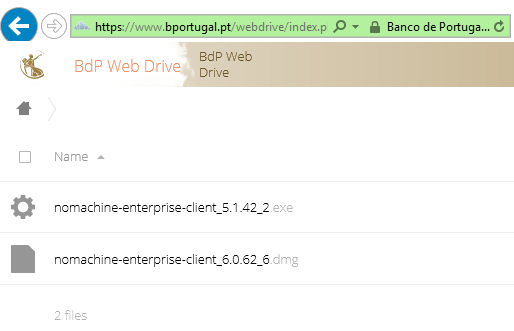{width=50%}

>

<!---
\newpage
-->

**Step 3**: Install 'NoMachine'.

>

> 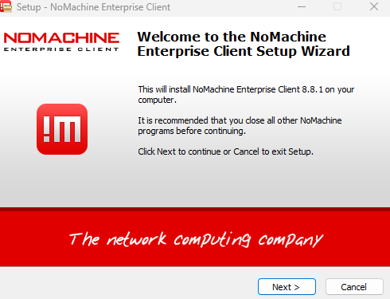{width=50%}

>

> {width=50%}

>

> 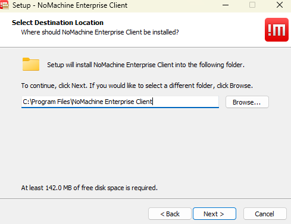{width=50%}

>

> {width=50%}

>

\newpage

**Step 4**: Reboot your computer

>

> {width=50%}

>

**Step 5**: NoMachine client access configuration.

> **Step 5.1**: Start 'NoMachine' and create a new connection.

>

> {width=50%}

>

> {width=50%}

>

\newpage

> **Step 5.2**: Define the 'Host' as bplimexterno.bportugal.pt, 'Port' 4000, 'Protocol' NX and set a 'Friendly Name' for 'Name'.

>

> {width=50%}

>


> **Step 5.3**: Use password authentication -- with or without a proxy -- according to the instructions provided by your network administrator or IT support. The proxy settings can be customized under Proxy in the bottom-right corner. After completing the configurations, click Add to create the connection.

>

> {width=50%}

>

> **Step 5.4**: Once the entry for `bplimexterno.bportugal.pt` has been created, connect:

>

> 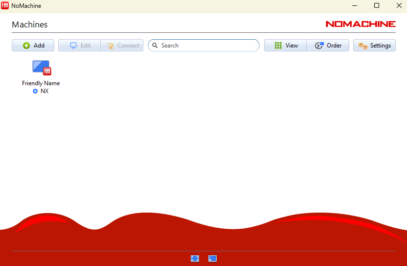{width=50%}


> **Step 5.5**: Before the first effective connection, it may be necessary to accept the certificate from bplimexterno.bportugal.pt. You should verify that the \"fingerprint\" (verification code) is:

>

> **SHA256 ED 1B D9 E2 C2 F8 C6 08 1A 53 5F 97 DA 71 77 D9 D2 EE 7A 5F 9C 35 87 B3 19 F4 7E A1 CB 2C 68 0B**

>

> 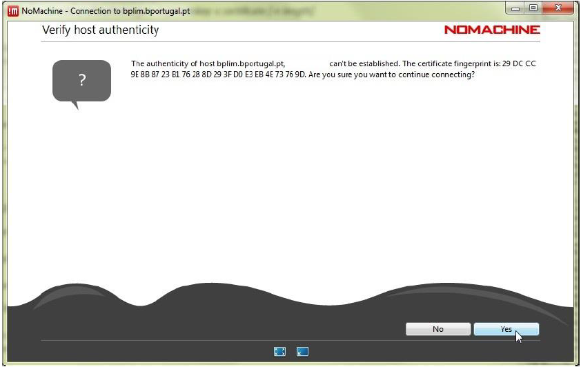{width=50%}

>

<!---
\newpage
-->

> **Step 5.6**: Connect with the UserID (**case sensitive**) and password provided by Banco de Portugal:

>

> {width=50%}

>

> **Step 5.7**: After the first successful login, it is necessary to change the password, which must comply with the Password Policy defined Section 1.2.

>

> 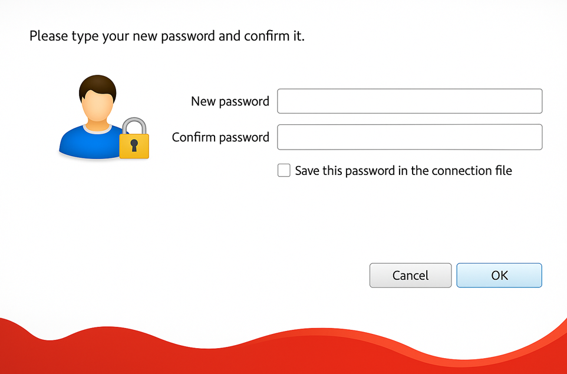{width=50%}

>

> If the new password does not comply with the Password Policy, the original password provided by the Banco de Portugal will be re-requested. You get the message "Authentication failed, please try again." See Appendix 3 for details.

>

> {width=50%}

>

> The NoMachine client does not tell you why the new password was not accepted -- it is the responsibility of the user to verify that the new password is in compliance.

>


> **Step 5.8**: Upon login success, the following screens should appear.

>

> 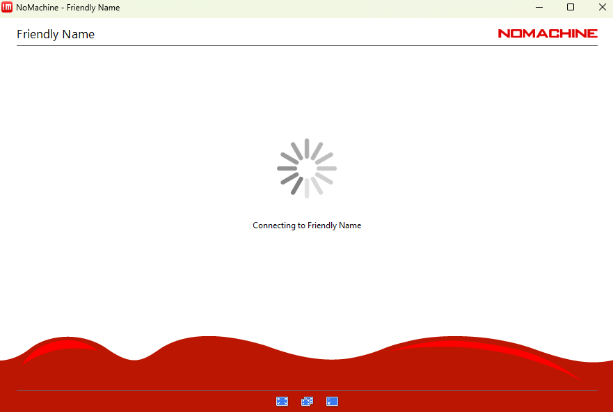{width=50%}

>

> Create a new desktop.

>

> 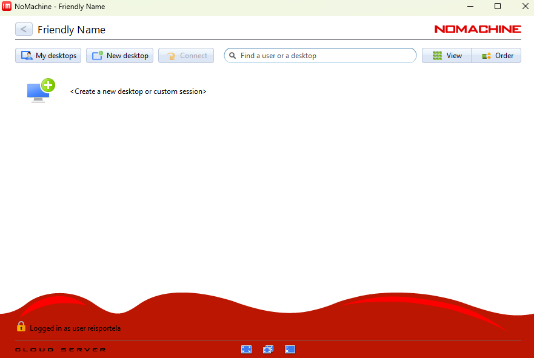{width=50%}

>

<!---
\newpage
-->

> **Step 5.9**: In the following screen define the settings of your monitor.

>

> 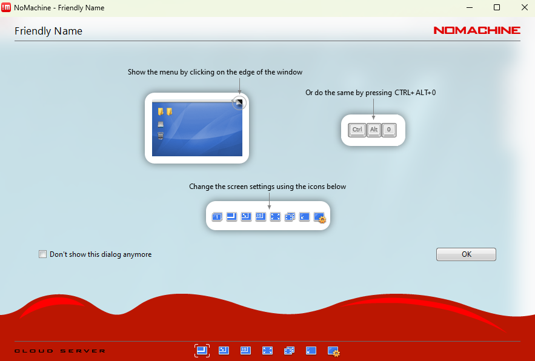{width=50%}

>

> {width=50%}

>

> {width=50%}

>

> {width=50%}

>

> **Step 5.10**: Upon login success, the following screens should appear.

>

> Once logged in and with access to a KDE session, click on the upper right corner of the KDE desktop, as shown below, to access the menu and then expand the screen as exemplified for greater ease of use.

>

> 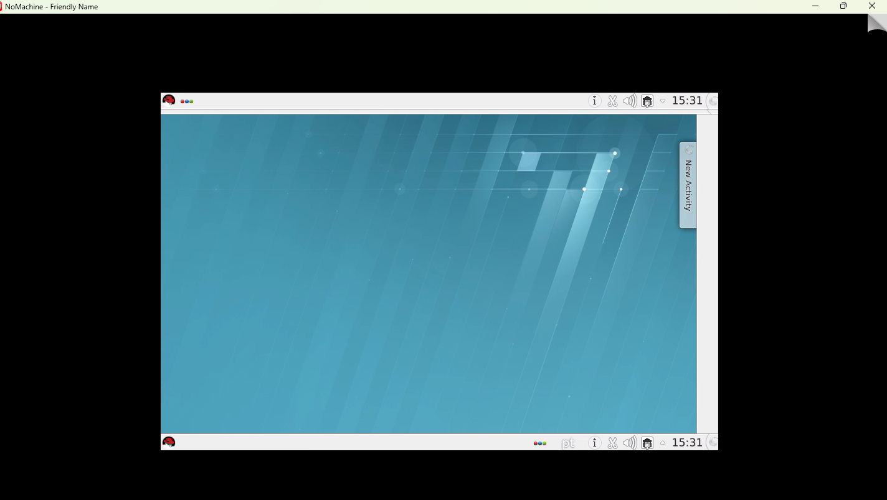{width=50%}

>

<!---
\newpage
-->

> **Step 5.11**: You should see the following screen.

>

> {width=50%}


>

<!---
\newpage
-->


> **Step 5.12**: Click 'Display'.

>

> {width=50%}

>

> **Step 5.13**: Choose the option that best fits your monitor.

>

> {width=50%}

>

>

## Frequently Asked Questions

1.  **Mac users cannot install NoMachine and receive the error below:**

>

> {width=50%}

>

- Ensure your **macOS** is up to date.  
- As a temporary solution, download the **NoMachine Enterprise Client** from the official website and run the installation file.


> [NoMachine Client](https://www.nomachine.com/pt-pt/product&p=NoMachine%20Enterprise%20Client)

>

2.  **NoMachine authentication failure**


>

> {width=50%}


>

   - This may happen due to a mismatched keyboard layout.  
     For example, if you use a **Portuguese keyboard** but the system assumes a **US keyboard**, a password containing `ç` may be rejected as "wrong password."  
     Verify your keyboard layout or change your password after the first login using:

     ```bash
      passwd
     ```

   - If login fails with the error:  
     *"Could not connect to the server. Error is 138: Connection is timed out"*  
     check whether your network firewall is blocking the connection.  
     Some university networks block external connections to BPLIM’s server.  
     Test from another location (e.g., your home network).

3.  **User pressed 'Lock' instead of 'Log out' and cannot unlock**

   - Check that the keyboard layout is correct (e.g., PT or UK).  
   - Close the NoMachine session and start a new one. Before the final **Login** step, right-click and choose **Logout**, then double-click to reconnect.


>

4.  **"Cannot see the screen in NoMachine"**

>

> {width=50%}

>

   - **Option A**: Move your mouse to the top-right corner of NoMachine.  
     A folded-sheet icon will appear. Left-click → **Display → Change settings** → enable **Disable client-side hardware decoding**.


>

> {width=50%}


>

   - **Option B**: Close the NoMachine connection and start a new one. Before the final **Login** step, right-click and choose **Logout**, then double-click to reconnect.


>

<!---
\newpage
-->


5. **"Error: Parameter 'agentm_display' has bad value"**

>

> 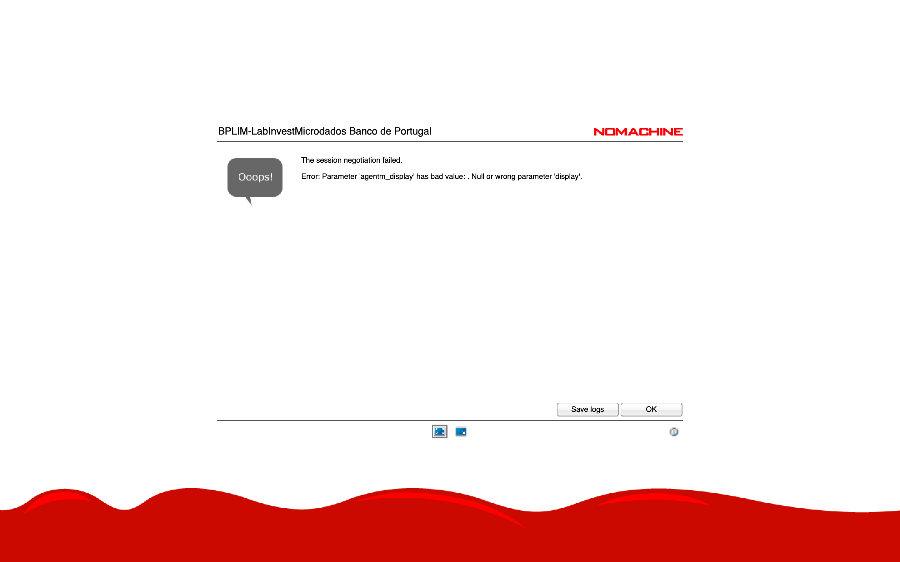{width=50%}

>

   - This usually means your home folder is full (`/home/USER_LOGIN`).  
     **Do not save files in your home folder.**  
   - Ask the BPLIM Team to free up space in your home directory.


>

6.  **Session is frozen**

  - From the first NoMachine screen, double-click the following icon:  

>

> {width=35%}

>

  - Then right-click the icon below and choose **Terminar sessão**:

>

> {width=35%}

>

<!---
\newpage
-->


7. **Visualizing LaTeX tables**

   If you want to preview a table exported to LaTeX as a PDF, create a simple file named `main.tex`:

   ```latex
   \documentclass{article}
   \begin{document}
     \input{your_table.tex}
   \end{document}
   ```

   Replace `your_table.tex` with the name of your table file. Compile it in the Terminal with:

   ```bash
   pdflatex main.tex
   ```

   This generates `main.pdf`, which you can view with:

   ```bash
   okular main.pdf
   ```
  

## Version Control with GitLab

The server provides [GitLab](https://about.gitlab.com/) for version control. Git is a distributed version-control system for tracking changes in files, ideal for managing code and scripts across your research project.

**To request Git access:** Contact the BPLIM Team at <bplim@bportugal.pt>.

### Benefits of Using Version Control

- Track all changes to your code and scripts
- Revert to previous versions if needed
- Collaborate with team members
- Maintain a complete history of your research workflow

### Getting Started with Git

#### Generate an SSH Key

Open a Terminal in your home folder and generate an SSH key:

```bash
cd ~
ssh-keygen -t rsa -C "BPLIM git"
cat ~/.ssh/id_rsa.pub
```

Highlight the generated key, right-click, and select **Copy** to copy it to your clipboard.

#### Access GitLab

Open Firefox (Red Hat → Search → Firefox) and navigate to:

[https://vxpp-bplimgit.bplim.local/](https://vxpp-bplimgit.bplim.local/)


>

> 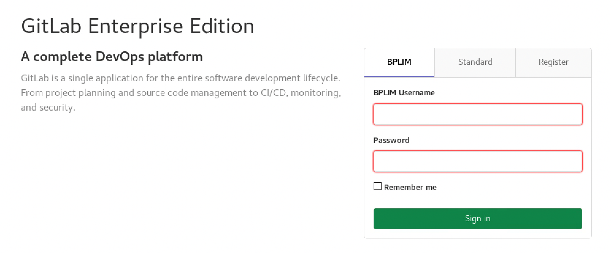{width=50%}

>

Log in with your external server credentials.

#### Add Your SSH Key in GitLab

- Navigate to your profile by clicking **Settings** in the top-right corner

>

> {width=35%}

>

- In the left sidebar, click **SSH Keys**

>

> {width=35%}

>

- Paste your SSH key in the **Key** text box

>

> 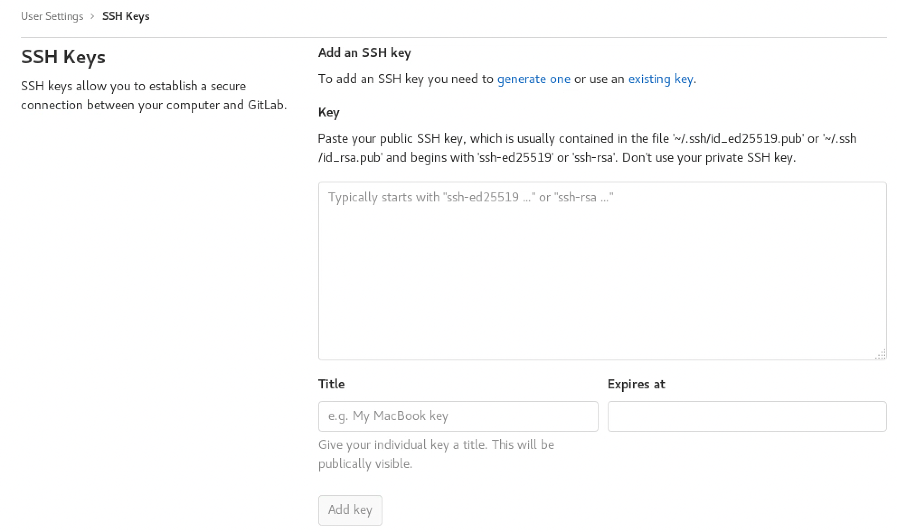{width=50%}

>

- Enter a title (e.g., "BPLIM git") and click **Add key**


#### Create a New GitLab Project

Go to **Projects** → **New project** and create a repository (e.g., `scripts_P999`).


>

> {width=50%}

>

> {width=40%}

>

#### Configure Git

Create or edit the `.gitconfig` file in your home folder. Use KWrite (Red Hat → Search → KWrite):

```bash
[cola]
        spellcheck = false
[user]
        name = Your Name
        email = your_username@sxpe-bplim01.bplim.local
[gui]
        editor = kwrite
```

#### Clone Your Project

In the Terminal, navigate to your `work_area` and clone the repository:

```bash
cd /bplimext/projects/P999_research_project/work_area/
git clone git@vxpp-bplimgit.bplim.local:username/scripts_P999.git
```

#### Add .gitignore File

Copy the `.gitignore` template from your project's `tools` folder:

```bash
cd scripts_P999
cp /bplimext/projects/P999_research_project/tools/.gitignore .
```

#### Make Your First Commit

```bash
git add *
git commit -a -m "Initial commit"
git push
```

#### Best Practices

- Store all your scripts and code in the Git repository folder (e.g., `scripts_P999`)
- Commit changes regularly with descriptive messages
- Pull before you push to avoid conflicts
- Use branches for experimental work


## Building Custom Containers

If you need custom software packages or specific versions, you can request a custom container.

### Steps to Build a Custom Container

#### Create a Container Definition

Use the template files available in the [BPLIM Containers GitHub repository](https://github.com/BPLIM/Containers).

#### Test and Build Using Sylabs Cloud

- Sign in to [Sylabs Cloud](https://cloud.sylabs.io/) (use your GitHub account)
- Click **CREATE**:

>

> 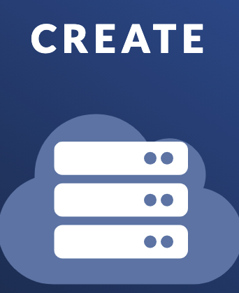{width=20%}

>

- Upload your `.def` file or paste its contents:

>

> {width=30%}

>

- Sylabs validates your script. Once successful, click **Build**
- Monitor the build process for any errors
- After successful build, send the **definition file** to the BPLIM Team

#### Using Your Custom Container

Once the BPLIM Team builds your container, it will be placed in your project's `tools/_container` folder.

To use it:

```bash
cd /bplimext/projects/P999_research_project/tools/_container
singularity shell YOUR_CONTAINER_ID.sif
```

The Terminal prompt changes to `Singularity>`, indicating you're inside the container. You now have access to your custom software environment.

>

> {width=20%}

>

Launch applications as needed (e.g., `rstudio` for RStudio).


## Jupyter Lab

[JupyterLab](https://jupyter.org/) is a web-based interactive development environment for notebooks, code, and data. It provides a flexible interface for data science, scientific computing, and machine learning workflows.

### Starting JupyterLab

From within a container (Python or Julia), run:

```bash
jupyter lab --browser=firefox
```

This opens JupyterLab in Firefox, providing an integrated environment for:

- Interactive notebooks (Python, Julia, R)
- Code editing and execution
- Data visualization
- Terminal access

### Example JupyterLab Session

>

> 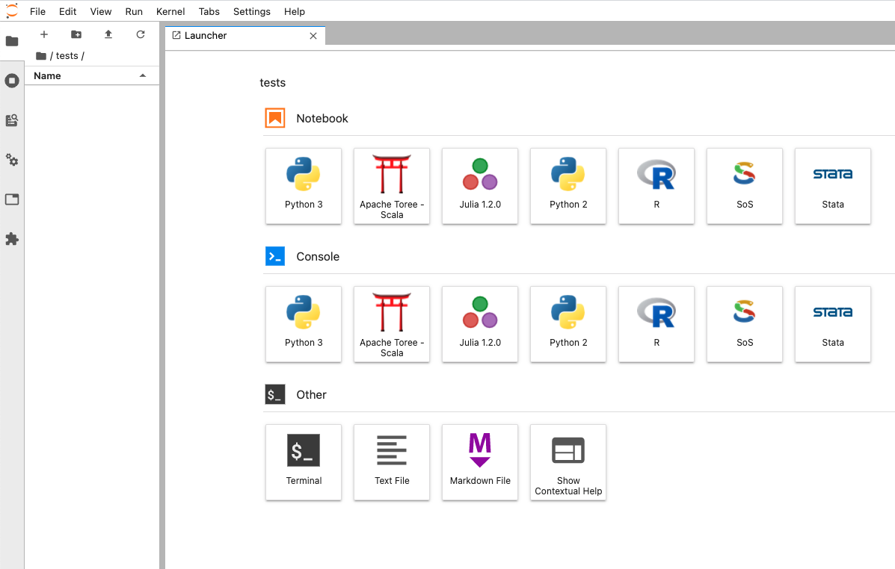{width=65%}

>

**Tip:** JupyterLab is ideal for exploratory data analysis and prototyping. For production scripts, consider using dedicated `.py`, `.R`, or `.jl` files.

[^1]: **Dolphin** is the file manager included with the KDE desktop environment. You can browse folders, create/delete files and folders (right-click for context menu), and manage your project files. More information: [https://userbase.kde.org/Dolphin](https://userbase.kde.org/Dolphin)

[^3]: Click the cross button in the upper-right corner of the NoMachine window to close the connection.

[^4]: Before logging out, ensure all active programs are closed (unless running in batch mode). Batch mode is recommended for computationally intensive or long-running tasks.

[^7]: **Output extraction rules:** Only non-sensitive text files without identifiable information can be extracted. For each graph requested, you must provide the corresponding data table for replication. Graphs must be in PNG format; vector graphics are not permitted.

[^8]: **Singularity** is now called [Apptainer](https://apptainer.org). Both names refer to the same container technology. Documentation: [https://apptainer.org](https://apptainer.org)

[^9]: **Containers** are self-contained environments that include software and all its dependencies (libraries, configurations, packages). This ensures consistent behavior across sessions and enables reproducible research. Each container is isolated, preventing conflicts between different projects' software requirements.
