<!---

1. open TERMINAL
2. RUN THE FOLLOWING LINE IN THE TERMINAL

pandoc --toc --number-sections External_Server_Guide.md --pdf-engine=xelatex -o External_Server_Guide.pdf

pandoc External_Server_Guide.md --pdf-engine=xelatex --toc --number-sections -V documentclass=scrartcl -V toc-title=Contents -V geometry:top=27mm -V geometry:bottom=27mm -V geometry:left=27mm -V geometry:right=27mm -V colorlinks=true -V linkcolor=blue -V urlcolor=blue -V citecolor=blue -o External_Server_Guide.pdf


ALTERNATIVE

https://marketplace.visualstudio.com/items?itemName=yzane.markdown-pdf

-->

<!---

About BPLIM
=========================

The ability to collect and accumulate microdata has been a powerful
function of central banks. In the scientific community, an increasing
number of research has been conducted using the micro-level
information. To enhance collaborations between the central bank and
the researchers, an advanced data-sharing platform is essential.
Accordingly, the Banco de Portugal Microdata Research Laboratory
(BPLIM) (*Laboratório de Investigação em Microdados do Banco de
Portugal*) is created to facilitate future scientific research effort
that incorporates the use of microdata. By eliminating the data access
barrier, BPLIM aims to inspire researches that effectively utilize the
Portuguese administrative micro datasets and contribute to our
understanding of the economic and financial challenges of our time.

Data Confidentiality
==================================

While researchers prefer unrestricted access to data, care must be
given to secure the confidentiality of the data providers. All the access
granted to microdata should obey the applicable law, and the data
should only be used for research purposes.

Therefore, the data is only made available to the Banco de Portugal's
internal researchers and those approved external researchers who have
agreed to the bank's legal provisions concerning the use of its data.
Specifically, each external researcher is required to sign a
Confidentiality Agreement with the bank and will only be allowed to
access a customized set of data that is tailored to his/her research
needs. All micro data sets made accessible to external researchers
will be anonymized and stored in information systems belonging to
Banco de Portugal (BdP).

The type of access to the Microdata varies according to levels of
confidentiality (low, medium, high).

-   **Low**: information that can be obtained from the public or
    scientific community by other institutions

-   **Medium**: information pertaining to institutions (firms, banks,
    etc.) not included in the previous case (some CB, CRC Firms, Bank
    Balance Sheet Data).

-   **High**: information about individuals or households not included
    in the **Low** case (CRC Individuals).

-->

<!--=========================================== --->

\newpage

# Access to the External Server

## Upon Access Approval

Once access is approved, you can connect to the external server using the **NoMachine** client.  
See [Download, install and configure NoMachine client](#install_nomachine) for detailed instructions.

---

## Password Policy

- The first password provided must be changed at your first login.  
- Passwords expire after **60 days**. When this happens, the login window will prompt you for a new password.  
- Passwords must comply with the rules described in [Password requirements](#password).

---

## First Steps

1. When you start **NoMachine**, you will see the following three screens:

>

> {width=65%}

>

> {width=65%}

>

> 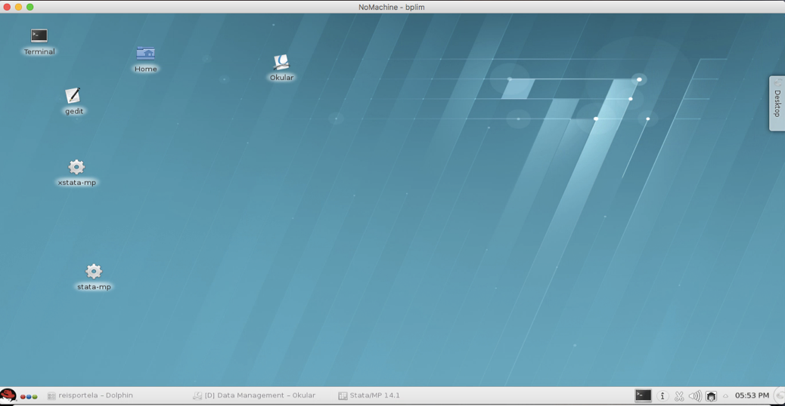{width=65%}

>

2. Select the "**Kickoff Application Launcher**" menu:

>

> {width=10%}

>

> {width=50%}

>

3. Then:

   1. Click on **Applications**.

   2. Select **BPLIM** and click on your project (e.g., `PXXX_name`).  
      You will then see a graphical environment (the **Dolphin** file manager[^1]): 

>

> 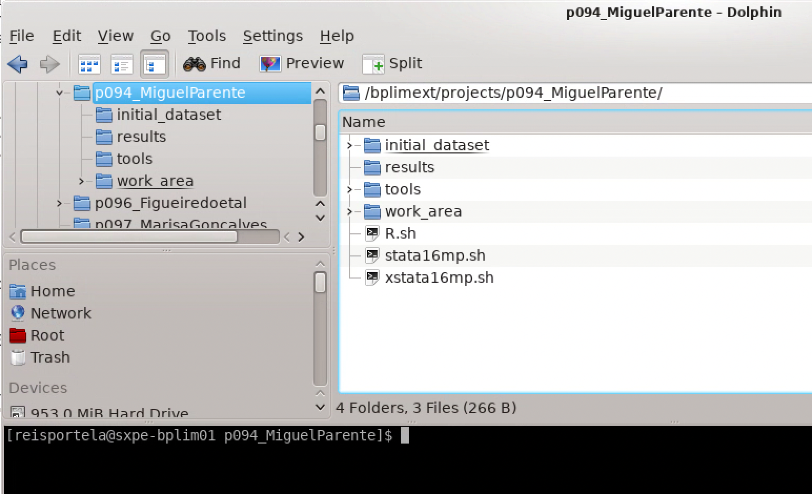{width=50%}

>

 You can display the command line (`Terminal`) alongside Dolphin by pressing **F4**.

4. Files with the `.sh` extension are scripts used to launch applications or enter an interactive environment.  
   For example, `stata_container.sh` starts the graphical version of Stata.  
   You can run these scripts either by double-clicking them in Dolphin[^2] or by typing in the Terminal:

   ```bash
    ./stata_container.sh
   ```

5. Within your project folder, you will have access to the following directories:

| Directory                  | Purpose                               | Access     |
| -------------------------- | ------------------------------------- | ---------- |
| `initial_dataset`          | Data sources provided by BPLIM        | Read-only  |
| `initial_dataset/modified` | Modified data provided by BPLIM       | Read-only  |
| `results`                  | Output files generated by researchers | Read–write |
| `tools`                    | Project-specific analysis tools       | Read-only  |
| `work_area`                | Temporary working directory           | Read–write |
| `/bplimext/doc/Manuals`    | Manuals and auxiliary files           | Read-only  |


  - Your **work\_area** folder also contains templates for both Stata and R(`R.sh`). By default, these template files are read-only.

6. To reset and disconnect the remote desktop session, log out as shown below. After logging out, close the NoMachine window.[^3]

>

> 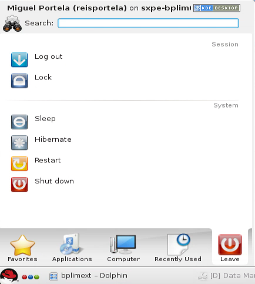{width=50%}

>

Confirm before exiting by clicking **Logout**:[^4]

>

> {width=25%}

>

- If you do not log out, your session will remain open until your next login. This may be useful to keep programs running, but note:

    - Leaving sessions open consumes server resources.

    - The recommended method for running programs overnight is **batch mode** (see discussion below).

    - If the server is rebooted for maintenance, your session will be closed and unsaved work will be lost. We strongly recommend saving your statistical programs at regular intervals.


# Important Guidelines

## Keep your home area tidy

- **Do not save files in your home area** (`/home/USER_LOGIN`).  
  If you exceed its size limit, you will not be able to log in.

- Check the size of your project regularly. Open a Terminal and follow these steps:

  1. Move to the project folder:

     ```bash
      cd /bplimext/projects/PXXX_name/
     ```

  2. List the total project size:

     ```bash
      du -h
     ```

  3. Check folder sizes and list those $\geq$ 1 GB:

     ```bash
      du --max-depth=1 -h | sort -h | grep G
     ```

  4. Move to the `work_area` folder:

     ```bash
      cd work_area
     ```

  5. Repeat the size check in this folder:

     ```bash
      du --max-depth=1 -h | sort -h | grep G
     ```

  6. Identify duplicate or temporary files and remove them:

     ```bash
      rm FILE_TO_DELETE
     ```

  7. Compress large files or folders you are not currently using:

     - Compress a folder:
       ```bash
        tar -zcvf YOUR_FOLDER.tar.gz YOUR_FOLDER
       ```

     - Compress an individual file:
       ```bash
        gzip YOUR_FILE
       ```

---

## Using the Terminal

The Linux Terminal is a command-line interpreter. You can use the shell for many tasks, such as searching files and contents, organizing your workspace, and—most importantly—running programs in **batch mode**.

1. Access the Terminal from:  
   **Red Hat → Applications → System → Terminal**

>

>   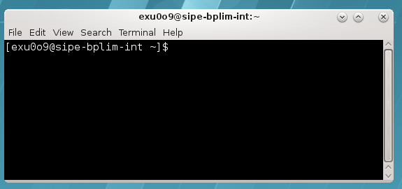{width=50%}

>

2. See [Shell Commands](#shell_commands) for a list of frequently used commands.

3. If you use a non-English keyboard, the actual key mapping may differ from what you see on the screen. This mainly affects symbols.

   Example: on a Portuguese keyboard, `+` is on the `?` key, and `*` is on `SHIFT + ?`. This depends on your operating system.

4. Linux is **case-sensitive**. For example, `LS` and `ls` are different commands.

5. Use the **arrow keys** to scroll through previously entered commands.

6. Use the **Tab** key for automatic command-line completion.

7. Example: list elements within a folder in a human-readable format (`h`), long list (`l`), reverse order (`r`), sorted by modification time (`t`), including almost all files (`A`):

   ```bash
     ls -lArth
   ```


# Statistical Software {#statistical_software}

The installation of additional commands or packages must be requested from the BPLIM team at **bplim@bportugal.pt**. Researchers are not allowed to install new commands or packages on the server independently.

## Stata

Stata versions available on the server: **15 through 19.5 (Stata Now)**. The way you run Stata depends on your project configuration.

### Running Stata inside a container

For projects configured with a container, Stata must be run within that environment.  
In this case, you will find a launcher script named **`stata_container.sh`** in your project folder.  

You can start Stata in any of the following ways:

- **Using the file manager** (Dolphin): double-click the `stata_container.sh` file to launch Stata.

- **Using the Terminal**:  
  1. Open a Terminal in the project folder.  
  
  2. Run:  
  
  ```bash
    ./stata_container.sh
  ```

- **Manually opening the container**:

  ```bash
    cd /bplimext/projects/PXXX_name
    singularity shell tools/_container/CONTAINER_ID.sif
  ```

Then start Stata inside the container:

  ```bash
    xstata-mp
  ```

If your project does **not** currently use a container and you would like to upgrade to the latest version of Stata, please contact the **BPLIM Team**.

### Running Stata natively (installed locally)

For accessing the native Stata installations (versions 15 to 18), follow the instructions below.

Stata can be run in **interactive graphical** or **non-graphical** modes.[^6]

---

#### Interactive non-graphical mode

1. Move to the desired folder, for example:
   
   ```bash
    cd /bplimext/projects/PXXX_name/
  ```

2. Launch Stata by typing:
   
   ```bash
    stata16-mp
  ```

>

> {width=50%}

>

To make launching easier, you can add Stata to your PATH. For example, for Stata 16:

  ```bash
    vi ~/.bash_profile
    # Add the following line
    PATH=$PATH:$HOME/.local/bin:$HOME/bin:/opt/bplimext/stata16
    export PATH
  ```

#### Interactive graphical mode

Click on the desktop icons such as `xstata16mp.sh` (Stata 16) depending on the version you want.

>

> {width=15%}

>

> 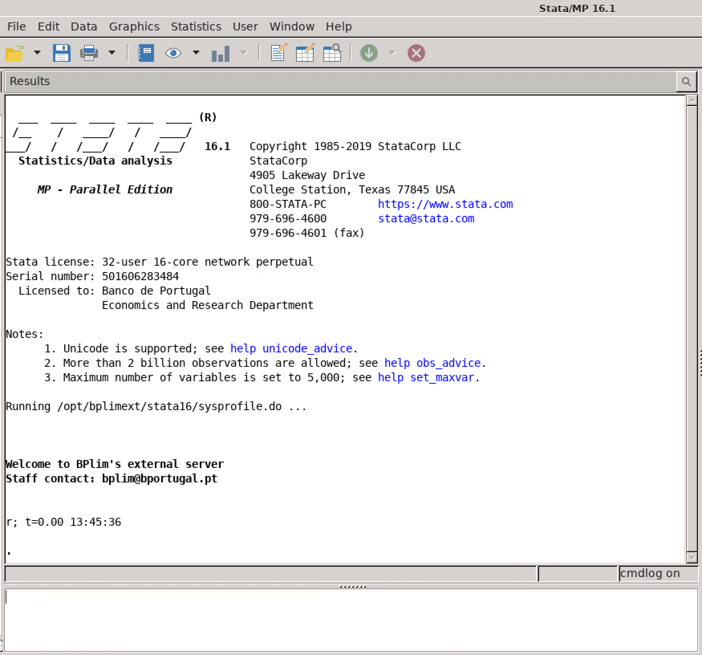{width=50%}

>

  - You can use the 'Do-file Editor' in Stata to create your own "do-files" and "ado-files", or use another such as **KWrite** (or **gedit**).

  - Open KWrite via: **Red Hat** → **Applications** → **Utilities** → **KWrite**
  
  - Or from the Terminal: `kwrite`

If the Stata icon is not on your desktop, use **Dolphin**, navigate to `/bplimext/scripts/wrappers/`, and drag the file **xstata16-mp** to the desktop.

>

> 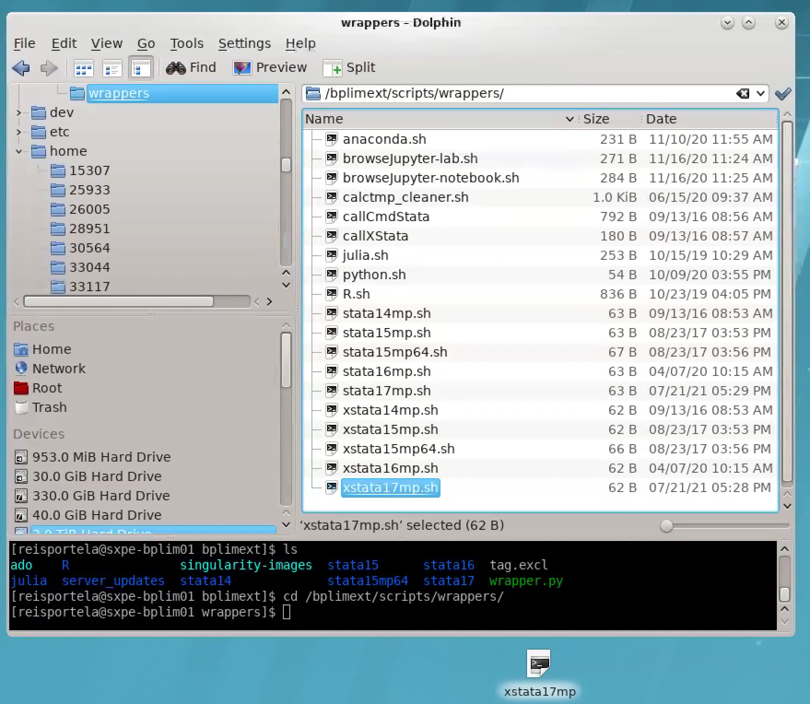{width=50%}

>

**NOTE**: Use the shortcuts provided in your project folder to start Stata.

#### Ado-files

Ado-files are text files containing Stata programs. It is advisable to create and save your ado-files so results can be replicated later when running them on BPLIM datasets.

Stata looks for ado-files in several locations, typically organized as:

- **SITE** – system-wide ado-files

- **PLUS** – user-installed ado-files

- **PERSONAL** – user-created ado-files

- **OLDPLACE** – legacy location for ado-files


Ado-files created for your project can be found in the current directory (`.`). Specific ado-files requested from BPLIM will be placed in `/bplimext/projects/PXXX_name/tools`.
To ensure Stata recognizes this directory, run inside Stata:

  ```bash
    sysdir set PERSONAL "/bplimext/projects/PXXX_name/tools"
  ```

You may also edit your `profile.do` file, located in your project root (`/bplimext/projects/PXXX_name/`), to include commands that should run at every Stata startup. For example:

  ```bash
    sysdir set PERSONAL "/bplimext/projects/PXXX_name/tools"
  ```

The `sysdir` command within Stata will list all directories currently in use:

>

> {width=50%}

>

#### Temporary files:

To manage Stata's temporary files:

1. Check the current temporary folder:

```bash
  tempfile junk
  display "``junk'"
  ```

2. In your project's work_area, create a folder named `.TMP`.

3. Edit your `.bashrc` in your home directory (`cd ~`) with `kwrite` or `vi and add:


```bash
  export STATATMP="/bplimext/projects/YOUR_PROJECT_ID/work_area/.TMP"
```

4. Apply the changes:

  ```bash
    source .bashrc
  ```

5. Log out from your Red Hat session (via the Red Hat menu) and reconnect using NoMachine.

6. Start Stata and confirm that the `tempfile` folder is pointing to `.TMP`.


## 'batch' mode: an example using Stata

1. Open a **shell** in Linux and navigate to the directory containing the do-file you want to run (e.g., `prog1.do`):

  ```bash
    cd /bplimext/projects/PXXX_name/work_area/
  ```

2. You may find it easier to use **Dolphin** (the File Manager) to browse your folder structure.
In Dolphin, press **F4** to open an integrated Terminal.
This allows quick navigation between folders and the ability to run shell commands in the same window.

3. Create a plain text file (ASCII) named, for example, `batch_prog1`.

4. Inside this file, write the execution command you would normally type in the shell. For example:

```bash
  stata-mp do /bplimext/projects/PXXX_name/work_area/prog1.do
```

5. To create the batch file, you can use any text editor. For instance, with the command-line editor `vi`:

  ```bash
    vi batch\_prog1
  ```

>

> {width=50%}

>

6. The batch file can also be created using graphical editors such as **KWrite** or the Stata **Do-file Editor**:

>

> {width=50%}

>

or

>

> {width=50%}

>

7. You may add the extension `.txt` to the batch file name. Sometimes the Stata Do-file Editor does not recognize files without an extension (e.g., `batch`), but it does recognize `batch.txt`.

8. Once the batch file is created, run the `.do` file in batch mode by typing in the Terminal:


  ```bash
    at now -f batch\_prog1
  ```
`
9. To explore more options for `at`, type `man at`. For example:

  ```bash
    at now + 5 hours -f batch\_prog1
  ```
`
  or

  ```bash
    at now + 4 minutes -f batch\_prog1
  ```

This runs the Stata program 5 hours or 4 minutes from now, respectively. (`man` displays the Linux help manual.)

10. Type `top` in the Terminal to confirm the program is running.

11. Inside `top`, press `i` to hide irrelevant processes and reduce the output shown.

12. To terminate a running process in top:

- Press `k` (for kill).

- Enter the process number (PID, shown in the first column).

- Then type `9` to force termination.

13. To exit `top`, press `q`.


### Useful features of the `at` command

- `atq` — lists programs in the batch queue (`=` indicates the program is running, `a` indicates it is queued along with its scheduled execution time).

- `atrm <job_number>` — removes a program from the batch queue.

- Monitor progress by checking the log file with `tail`:

  ```bash
    tail --f logcrc_may21.log
  ```

This continuously updates the last lines of the log without overwriting it.

### Running programs in the background with `screen`

- `screen` is useful if you want to run Stata interactively and ensure the session is preserved even if your network connection drops. You can disconnect from NoMachine and later recover the session by typing:

  ```bash
    screen --r
  ```

- Multiple `screen` sessions can run simultaneously. After reconnecting with NoMachine, list the running sessions:

  ```bash
    screen -d
  ```

Then recover a specific session by typing:

  ```bash
    screen -r <pid>
  ```

(replace <PID> with the actual process ID).


## R

### Running R inside a container (recommended)

R can run either natively or inside a container. For projects configured with a container, R should be started within that environment. In this case, you will find a launcher script named **`r_container.sh`** in the project folder. You can start R in the following ways:

- **Using the file manager** (Dolphin): double-click the `r_container.sh` file to launch RStudio inside the container.

- **Using the Terminal**:  
  1. Open a Terminal in the project folder.  
  2. Run:

  ```bash
    ./r_container.sh
  ```

- **Manually opening the container**:  
  ```bash
    cd /bplimext/projects/PXXX_name
    singularity shell tools/_container/CONTAINER_ID.sif
  ```

Once inside the container, then start RStudio

  ```bash
    rstudio
  ```


### Running R natively (installed locally)

R can be accessed in interactive graphical or non-graphical modes.

- **Interactive non-graphical mode**:  

  Click the **Red Hat** symbol and type `R` in the search box.

  {width=35%}

- **Using the Terminal**:  

  ```bash
    R
  ```

- **Interactive graphical mode**:  

Click the **Red Hat** symbol and type `rstudio` in the search box.


Using RStudio through the Terminal. Type in the Terminal:

  ```bash
    rstudio
  ```

If you experience issues opening or saving files in RStudio, run the wrapper script instead:

  ```bash
    /bplimext/scripts/wrappers/R.sh
  ```


**IMPORTANT**: Do **not** save your workspace image in your home folder when prompted (`Save workspace image? [y/n/c]`).  
If you need to keep the workspace, save it inside your project folder under `work_area`.

**RStudio Font Settings**: Please ensure you are **not** using the Courier font type.  
Go to **Tools → Global Options → Appearance** and select a different font.


## Python

You will find a launcher script named **`python_container.sh`** in the project root. You can start the Python container by double-clicking this script in **Dolphin**.

Alternatively, start the container from the **Terminal**:

  ```bash
    ./python_container.sh
  ```

You can also start the container manually:

  ```bash
    cd /bplimext/projects/PXXX_name
    singularity shell tools/_container/CONTAINER_ID.sif
  ```
Once inside the container, you can use Python directly or launch a Jupyter Notebook:

  ```bash
    jupyter notebook
  ```
A Jupyter Notebook will open in **Firefox**. Click New and select the **Python** kernel.


## Julia


If you plan to use Julia, request a project container with **Julia** enabled. The image (`.sif`) will be placed under your project at `tools/_container/`.

You will also find a launcher script named **`julia_container.sh`** in the project root. You can start Julia by double-clicking this script in **Dolphin**.

Alternatively, start Julia from the **Terminal**:

  ```bash
    cd /bplimext/projects/PXXX_name
    ./julia_container.sh
  ```

You can also start the container manually:

  ```bash
    cd /bplimext/projects/PXXX_name
    singularity shell tools/_container/CONTAINER_ID.sif
  ```
Once inside the container, you can launch the Julia REPL or Jupyter:

  ```bash
    # Julia REPL
    julia

    # or Jupyter Notebook
    jupyter notebook
  ```

A Jupyter Notebook will open in **Firefox**. Click New and select the **Julia** kernel.

Alternatively, you can use **VS Code** to run Julia. Open VS Code from the terminal (in your project folder):

  ```bash
    code
  ```


## Updates to Commands and Packages

Requests for additional commands or packages, as well as updates to existing ones, must be submitted to the **BPLIM Team**.


## Build a Container to Fine-Tune Your Statistical Packages

The server uses **Apptainer (formerly Singularity)** containers. To request one, please send the BPLIM Team the **definition file**. We will build the image and place it in your project’s `work_area`. Detailed information about Apptainer/Singularity containers is available at [https://sylabs.io/](https://sylabs.io/).[^8] Additional notes are provided in the Appendix.


# Allowed Outputs

Stata results can be exported to disk in the following formats:

1. **ASCII files** — e.g., log files  
2. **Graphs** — export as `.png`  
   > *Do not use the `save` option within a graph command. Instead, use a separate command:*  
   > ```stata
   > graph export xyz.png
   > ```
3. **CSV** — Comma-Separated Values, for use with MS Excel or similar  
4. **RTF** — Rich Text Format, for use with word processors  
5. **XLS / XLSX** — Excel files containing output tables  
6. **TEX** — LaTeX format for integration into TeX documents


# Removing Outputs

Output files (e.g., log files, images) must be requested from the **BPLIM Team** at **bplim@bportugal.pt**.  
Researchers are not allowed to place or remove files on the server independently.

Place in the **`results`** folder all the outputs you wish to have extracted from the server.[^7]

1. Send an email with the subject line:

   > **PXXX_name: request for result extraction**

   to:

   > **bplim@bportugal.pt**

2. After validation, the requested results will be sent to you by email.


# User's Home Folder

1. Do **not** save files in your home folder:  
   `/home/USER_ID/`

2. Regularly empty your **Trash** folder.  
   If your disk usage exceeds the quota, you will not be able to log in.  
   To clean the Trash via Terminal, type:
    
  ```bash
    rm -rf ~/.local/share/Trash/*
  ```


# Scientific support

Researchers will be provided with the necessary scientific and computational support (*i.e.*, advises on programming, computational resources, micro econometrics, and econometrics of panel data for research undertaken with the selected microdata).


# Project Archival Policy

Projects that remain inactive for more than **two (2) years** will be archived.  
Archived projects will no longer be directly accessible but can be reactivated upon request to the **BPLIM Team**.


# Appendix

## Basic Shell Commands on Linux {#shell_commands}

- **`top`**: List processes currently running on the server  
  - Press `i` to hide background processes.  
  - Press `h` to display the **help menu** for available options.

- **`pwd`**: Show the current working directory

- **`cd`**: Change directory

  ```bash
    cd /bplimext/projects/PXXX_name/work_area/
  ```

-  `cd ~` moves to your home folder

-  `cp`: Copy file(s) to a given path

  ```bash
    cp prog1.do /bplimext/projects/PXXX_name/results
  ```

-   `mv`: Move file(s) or rename file(s)

    `mv prog1.do /bplimext/projects/PXXX_name/results`

-   `rm`: Delete a file

  ```bash
    rm /bplimext/projects/PXXX_name/results/prog1.do
  ```

-   `mkdir`: Create a directory

  ```bash
    mkdir programs
  ```

-   `rmdir`: Delete an empty directory

  ```bash
    rmdir programs
  ```

-   `screen`: Start a session manager that allows running programs in the background and resuming them later

  ```bash
    screen top
  ```

-   `man`: Show the manual page for a given command

  ```bash
    man ls
  ```

-   `du -h`: Display disk usage of files and directories in human-readable format

  ```bash
    du /bplimext/projects/PXXX_name/work_area/
  ```

-   `df -h`: Show disk space utilization in human-readable format

-   `vi`: View or edit ASCII text files (e.g., `.do` files, logs)

-   `ghostscript`: Preview files with `.eps` or `.pdf` extensions

  ```bash
    ghostscript /bplimext/projects/PXXX_name/results/file_name.pdf
  ```

-   `okular`: View PDF files

-   `find`: Search for files

    - Basic structure: `find /path options pattern`

  ```bash
    find . -name "*.do"
  ```

    - Save search results to a file:

  ```bash
    find . -name "\*.do" > find_results.txt
  ```

    - Search for a string within filenames:

  ```bash
    find . -name "\*.do" | grep "analysis"
  ```

Identify `.do` files containing the word `graph export`:

  ```bash
    find . -name "\*.do" -exec grep "graph export" '{}' \; -print
  ```

-   `passwd`: Change your password

-   **Exit a program**: Press `CTRL + C` to terminate the current process in the shell


## Using the `vi` File Editor

1. Open a file in `vi` from the shell, for example:
   ```bash
    vi batch1.txt
   ```

2.  Common shortcut keys in `vi`

    a.  `i`: insert text

    b.  `ESC`: exit insert mode

    c.  `x`: delete the character under the cursor

    d.  `dd`: delete the current line

    e.  `10 dd`: delete 10 lines

    f.  `yy`: copy (yank) the current line

    g.  `p`: paste the copied (yanked) text

    h.  `SHIFT + G`: go to the last line

    i.  `gg`: go to the first line

    j.  `ESC + :q!`: quit without saving changes

    k.  `ESC + :w!`: write (save) and overwrite the file

    l.  `ESC + :q`: quit if no changes have been made

  > For a more complete guide, see:
        [https://www.cs.colostate.edu/helpdocs/vi.html](https://www.cs.colostate.edu/helpdocs/vi.html)

3.  Easier alternative: use the `gedit` text editor for a graphical interface:

  ```bash
    gedit batch1.txt
   ```


\newpage

## Password requirements{#password}

+-----------------------+-----------------------+-----------------------+
| **Rule**              | **Value**             | **Notes **            |
+-----------------------+-----------------------+-----------------------+
| Maximum Password      | **[60                 | *After 60 days the    |
| Lifetime              | days]{.underline}**   | password will         |
|                       |                       | expire*               |
|                       |                       | and has to be changed |
|                       |                       | in the next login.    |
|                       |                       | The password can be   |
|                       |                       | changed at any moment |
|                       |                       | using: **(1)**,"Red Hat|
|                       |                       | icon \| Applications  |
|                       |                       | \|Settings \| System  |
|                       |                       | Settings -- Account   |
|                       |                       | Details", click       |
|                       |                       | "Change Password";    |
|                       |                       | or, **(2)**, in the   |
|                       |                       | 'Shell' type 'passwd' |
+-----------------------+-----------------------+-----------------------+
| Minimum Number of     | 4                     | You should include at |
| Character Classes     |                       | least 4 classes of    |
|                       |                       | characters in the     |
|                       |                       | password. For         |
|                       |                       | example, small        |
|                       |                       | letters, capital      |
|                       |                       | letters, numbers and  |
|                       |                       | punctuation marks.    |
|                       |                       |                       |
|                       |                       | There are a total of  |
|                       |                       | five classes:         |
|                       |                       |                       |
|                       |                       | > 1\. Capital letters |
|                       |                       | :                     |
|                       |                       | > A-Z                 |
|                       |                       | >                     |
|                       |                       | > 2\. Small letters:  |
|                       |                       | > a-z                 |
|                       |                       | >                     |
|                       |                       | > 3\. Numbers: 1-9    |
|                       |                       | >                     |
|                       |                       | > 4\. Punctuation     |
|                       |                       | > marks: \<space\> !  |
|                       |                       | > % & ( ) \* + . , {  |
|                       |                       | > } \[ \] \~ \" \# \$ |
|                       |                       | > \' - / \\ \^ \_ \`  |
|                       |                       | > \|                  |
|                       |                       | >                     |
|                       |                       | > 5\. Characters above|
|                       |                       | > 127 (0x7F): marked  |
|                       |                       | > characters (ã, á,   |
|                       |                       | > ä, à, etc.);        |
|                       |                       | > symbols (@, £, §,   |
|                       |                       | > º, ª, «, », etc.)   |
|                       |                       |                       |
+-----------------------+-----------------------+-----------------------+
|                       |                       | Number of characters: |
|                       |                       | by using the same     |
|                       |                       | character 3 or more   |
|                       |                       | times may imply the   |
|                       |                       | use of an additional  |
|                       |                       | class (it is highly   |
|                       |                       | recommended that you  |
|                       |                       | do not use            |
|                       |                       | consecutively the     |
|                       |                       | same character more   |
|                       |                       | than 2 times)         |
+-----------------------+-----------------------+-----------------------+
| Minimum Length of     | 8                     | The minimum size of   |
| Password              |                       | the password is 8     |
|                       |                       | characters (it may be |
|                       |                       | higher in case you    |
|                       |                       | repeat characters)    |
+-----------------------+-----------------------+-----------------------+
| Password History      | 7                     | One cannot use a      |
|                       |                       | password defined in   |
|                       |                       | the previous set of 7 |
|                       |                       | passwords             |
+-----------------------+-----------------------+-----------------------+
| Maximum Consecutive   | 6                     | If the user fails 6   |
| Failures              |                       | consecutive times the |
|                       |                       | password the account  |
|                       |                       | will be locked for    |
|                       |                       | the time defined in   |
|                       |                       | "Lockout Time"        |
+-----------------------+-----------------------+-----------------------+
| Fail Interval         | 60 sec.               | Time interval for     |
|                       |                       | attempts to enter a   |
|                       |                       | password to be        |
|                       |                       | considered            |
|                       |                       | consecutive. If more  |
|                       |                       | than 60 seconds have  |
|                       |                       | elapsed since the     |
|                       |                       | last attempt,         |
|                       |                       | consecutive attempts  |
|                       |                       | are no longer         |
|                       |                       | considered, ie the    |
|                       |                       | number of failures,   |
|                       |                       | according to the      |
|                       |                       | requirement \"Maximum |
|                       |                       | Consecutive           |
|                       |                       | Failures\" becomes    |
|                       |                       | one.                  |
+-----------------------+-----------------------+-----------------------+
| Lockout Time          | 600 sec.              | Time (10 minutes)     |
|                       |                       | during which the      |
|                       |                       | account will be       |
|                       |                       | locked if the maximum |
|                       |                       | number of failed      |
|                       |                       | attempts is reached.  |
+-----------------------+-----------------------+-----------------------+


\newpage


## Download, install and configure NoMachine client{#install_nomachine}

**Step 1**: Go to the following link and use the credentials provided by BPLIM to access the site:

> [https://www.bportugal.pt/webdrive/index.php/s/irAzxZmir8KHyzD/authenticate](https://www.bportugal.pt/webdrive/index.php/s/irAzxZmir8KHyzD/authenticate)

> **Note**: sometimes the internet provider,*e.g.*, a University, may block access to this particular website.
Please check with your provider in case you get an error while trying to use the link.

>

> {width=50%}

>

**Step 2**: Download the file with an extension compatible with your OS (Operating System).

>

> {width=50%}

>

\newpage

**Step 3**: Install 'NoMachine'.

>

> {width=50%}

>

> 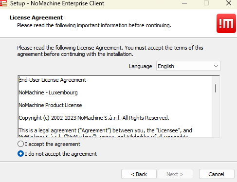{width=50%}

>

> {width=50%}

>

> 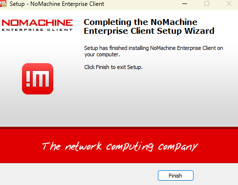{width=50%}

>

**Step 4**: Reboot your computer

>

> 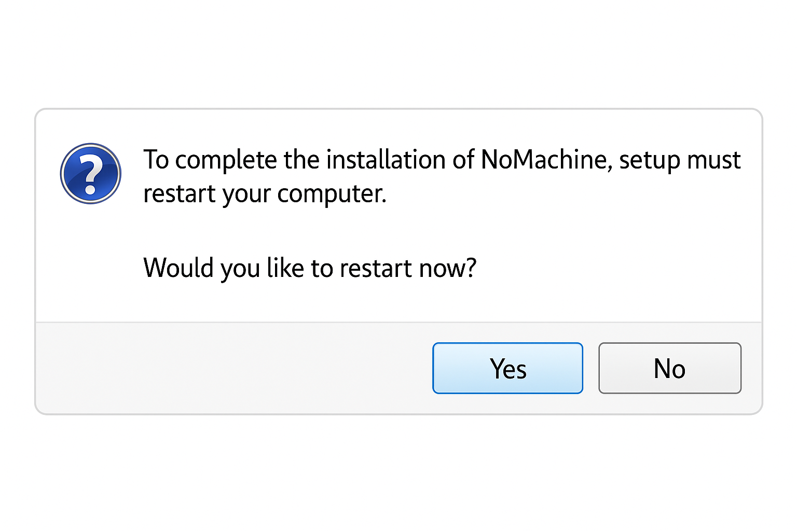{width=50%}

>

**Step 5**: NoMachine client access configuration.

> **Step 5.1**: Start 'NoMachine' and create a new connection.

>

> {width=50%}

>

> 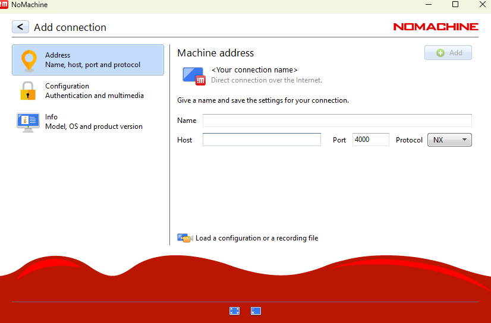{width=50%}

>

> **Step 5.2**: Define the 'Host' as bplimexterno.bportugal.pt, 'Port' 4000, 'Protocol' NX and set a 'Friendly Name' for 'Name'.

>

> 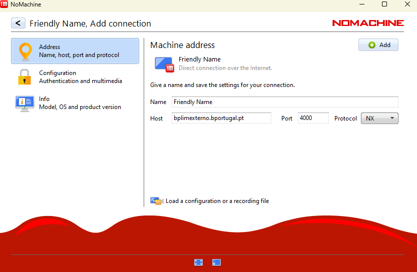{width=50%}

>


> **Step 5.3**: Use password authentication, with or without proxy, depending on the instructions of the network administrator/user \'s
computer support. Click 'Add' to create the connection.

>

> 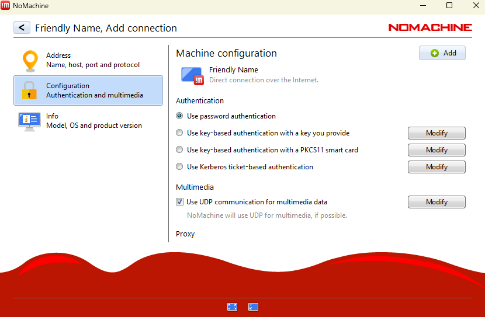{width=50%}

>

> **Step 5.4**: Once the entry for `bplimexterno.bportugal.pt` has been created, connect:

>

> {width=50%}


> **Step 5.5**: Before the first effective connection, it may be necessary to accept the certificate from bplimexterno.bportugal.pt. You should verify that the \"fingerprint\" (verification code) is:

>

> **SHA256 ED 1B D9 E2 C2 F8 C6 08 1A 53 5F 97 DA 71 77 D9 D2 EE 7A 5F 9C 35 87 B3 19 F4 7E A1 CB 2C 68 0B**

>

> {width=50%}

>

\newpage

> **Step 5.6**: Connect with the UserID (**case sensitive**) and password provided by Banco de Portugal:

>

> {width=50%}

>

> **Step 5.7**: After the first successful login, it is necessary to change the password, which must comply with the Password Policy defined above.

>

> {width=50%}

>

> If the new password does not comply with the Password Policy, the original password provided by the Banco de Portugal will be re-requested. You get the message "Authentication failed, please try again." See Appendix 3 for details.

>

> 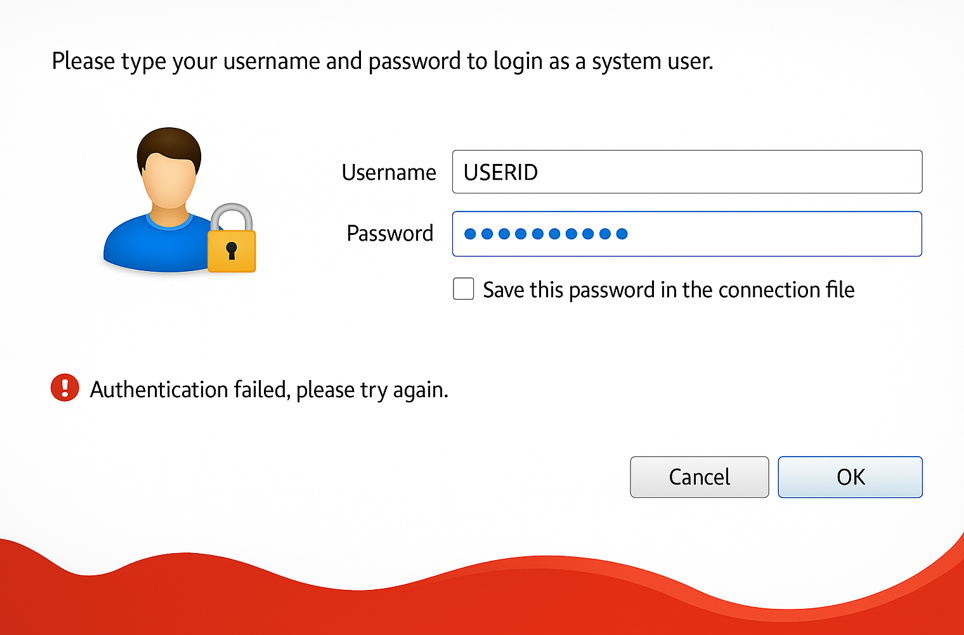{width=50%}

>

> The NoMachine client does not tell you why the new password was not accepted -- it is the responsibility of the user to verify that the new password is in compliance.

>


> **Step 5.8**: Upon login success, the following screens should appear.

>

> {width=50%}

>

> Create a new desktop.

>

> {width=50%}

>

\newpage

> **Step 5.9**: In the following screen define the settings of your monitor.

>

> {width=50%}

>

> 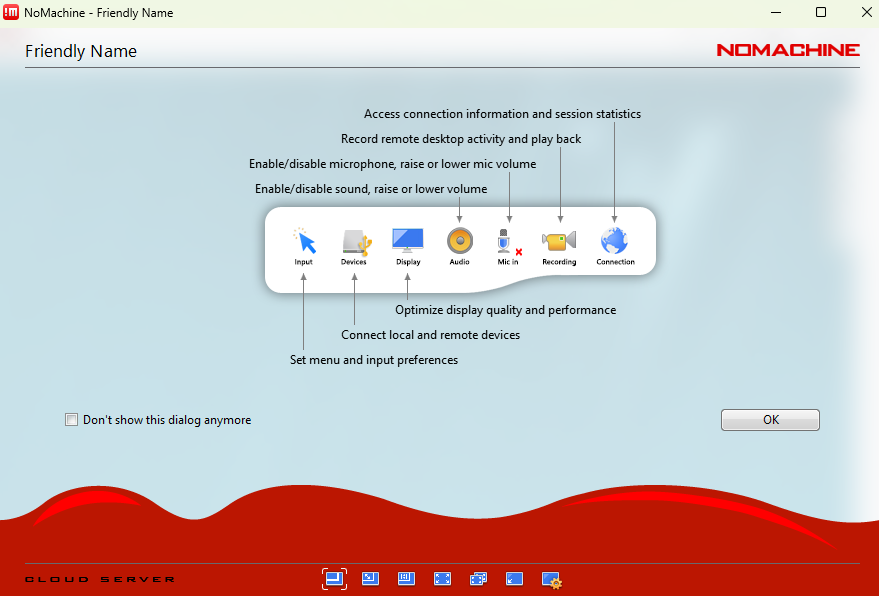{width=50%}

>

> 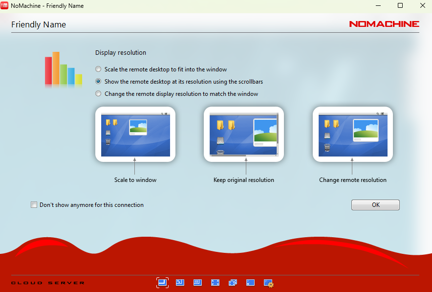{width=50%}

>

> {width=50%}

>

> **Step 5.10**: Upon login success, the following screens should appear.

>

> Once logged in and with access to a KDE session, click on the upper right corner of the KDE desktop, as shown below, to access the menu and then expand the screen as exemplified for greater ease of use.

>

> {width=50%}

>

> **Step 5.11**: You should see the following screen.

>

> {width=50%}


>

\newpage

> **Step 5.12**: Click 'Display'.

>

> {width=50%}

>

> **Step 5.13**: Choose the option that best fits your monitor.

>

> 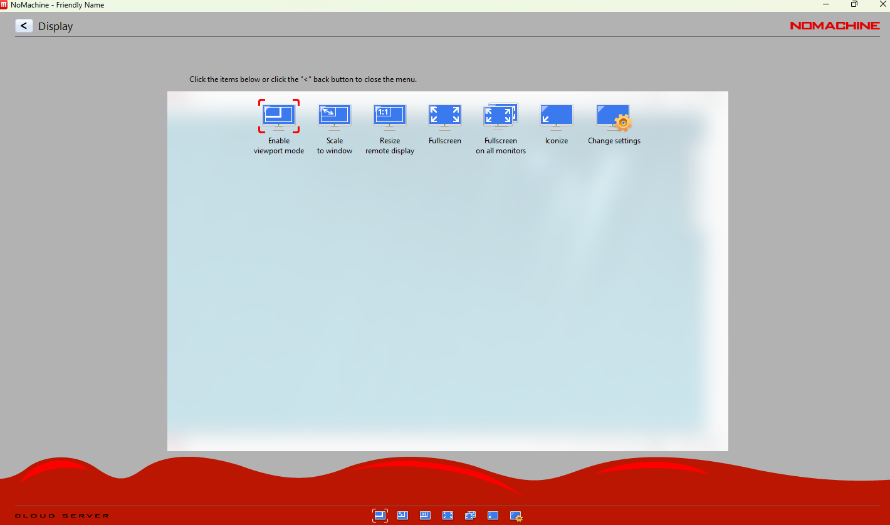{width=50%}

>

>

## Frequently Asked Questions

1.  **Mac users cannot install NoMachine and receive the error below:**

>

> 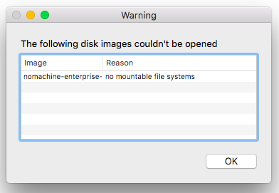{width=50%}

>

- Ensure your **macOS** is up to date.  
- As a temporary solution, download the **NoMachine Enterprise Client** from the official website and run the installation file.


> [https://www.nomachine.com/pt-pt/product&p=NoMachine%20Enterprise%20Client](https://www.nomachine.com/pt-pt/product&p=NoMachine%20Enterprise%20Client)

>

2.  **NoMachine authentication failure**


>

> {width=50%}


>

   - This may happen due to a mismatched keyboard layout.  
     For example, if you use a **Portuguese keyboard** but the system assumes a **US keyboard**, a password containing `ç` may be rejected as "wrong password."  
     Verify your keyboard layout or change your password after the first login using:

     ```bash
      passwd
     ```

   - If login fails with the error:  
     *"Could not connect to the server. Error is 138: Connection is timed out"*  
     check whether your network firewall is blocking the connection.  
     Some university networks block external connections to BPLIM’s server.  
     Test from another location (e.g., your home network).

3.  **User pressed 'Lock' instead of 'Log out' and cannot unlock**

   - Check that the keyboard layout is correct (e.g., PT or UK).  
   - Close the NoMachine session and start a new one. Before the final **Login** step, right-click and choose **Logout**, then double-click to reconnect.


>

4.  **"Cannot see the screen in NoMachine"**

>

> {width=50%}

>

   - **Option A**: Move your mouse to the top-right corner of NoMachine.  
     A folded-sheet icon will appear. Left-click → **Display → Change settings** → enable **Disable client-side hardware decoding**.


>

> {width=50%}


>

   - **Option B**: Close the NoMachine connection and start a new one. Before the final **Login** step, right-click and choose **Logout**, then double-click to reconnect.


>

5.  **"Error: Parameter 'agentm_display' has bad value"**

>

> {width=50%}

>

   - This usually means your home folder is full (`/home/USER_LOGIN`).  
     **Do not save files in your home folder.**  
   - Ask the BPLIM Team to free up space in your home directory.


>

6.  **Session is frozen**

  - From the first NoMachine screen, double-click the following icon:  

>

> {width=35%}

>

  - Then right-click the icon below and choose **Terminar sessão**:

>

> 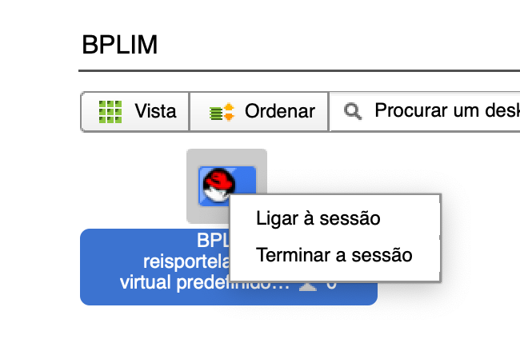{width=35%}

>


7. **Visualizing LaTeX tables**

If you want to preview a table exported to LaTeX as a PDF, create a simple file named `main.tex`:


  ```bash
    \documentclass{article}
    \begin{document}
      \input{your_table.tex}
    \end{document}
  ```

Replace your_table.tex with the name of your table file.
Compile it in the Terminal with:

  ```bash
    pdflatex main.tex
  ```
This generates `main.pdf`, which you can view with:

  ```bash
    okular main.pdf
  ```
  

## Version Control

The server runs [GitLab](https://about.gitlab.com/).  
If you need Git for your projects, please request access from the **BPLIM Team** (bplim@bportugal.pt).

From [Wikipedia](https://en.wikipedia.org/wiki/Git):

> *"Git is a distributed version-control system for tracking changes in any set of files, originally designed for coordinating work among programmers cooperating on source code during software development. Its goals include speed, data integrity, and support for distributed, non-linear workflows."*

---

### First Steps

1. **Generate an SSH key**  
   Open a **Terminal** in your home folder:

  ```bash
    cd ~
  ```


Then type:


  ```bash
    ssh-keygen -t rsa -C "BPLIM git"
    cat ~/.ssh/id_rsa.pub
  ```

2. **Copy your SSH key**

Highlight the generated key in the terminal, right-click, and choose Copy to copy it to your clipboard.


3. **Access GitLab**

Open **Firefox** (Red Hat → Search → Firefox) and navigate to: [https://vxpp-bplimgit.bplim.local/](https://vxpp-bplimgit.bplim.local/)


>

> {width=50%}


>

Log in with your external server credentials.


4. **Add your SSH key in GitLab**

- Navigate to your profile (**Settings** in the top-right corner).


>

> 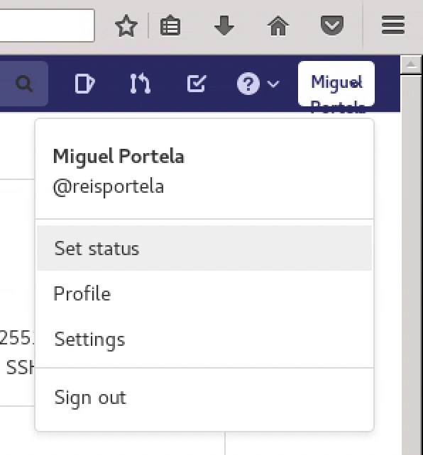{width=35%}

>


- In the left sidebar, click **SSH Keys**.


>

> 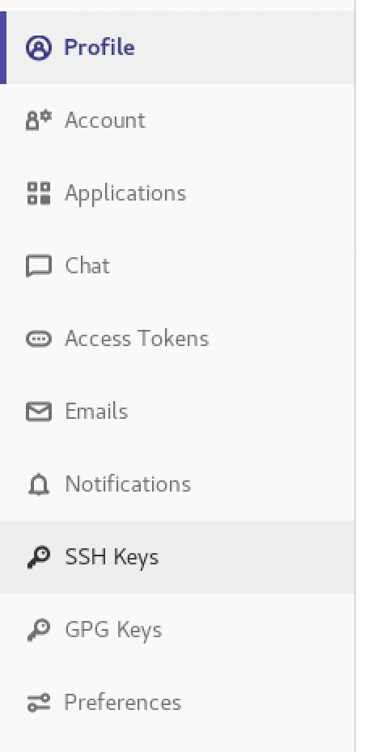{width=35%}

>


- Paste the contents of the clipboard in the text box on the top right corner under **Key**.


>

> {width=50%}

>


- Give a title, e.g., "BPLIM git", and click in **Add key**.


5. **Create a new project**

Go to **Projects** → **New project**, e.g., `scripts_P999` (replace `P999` with your project ID).


>

> 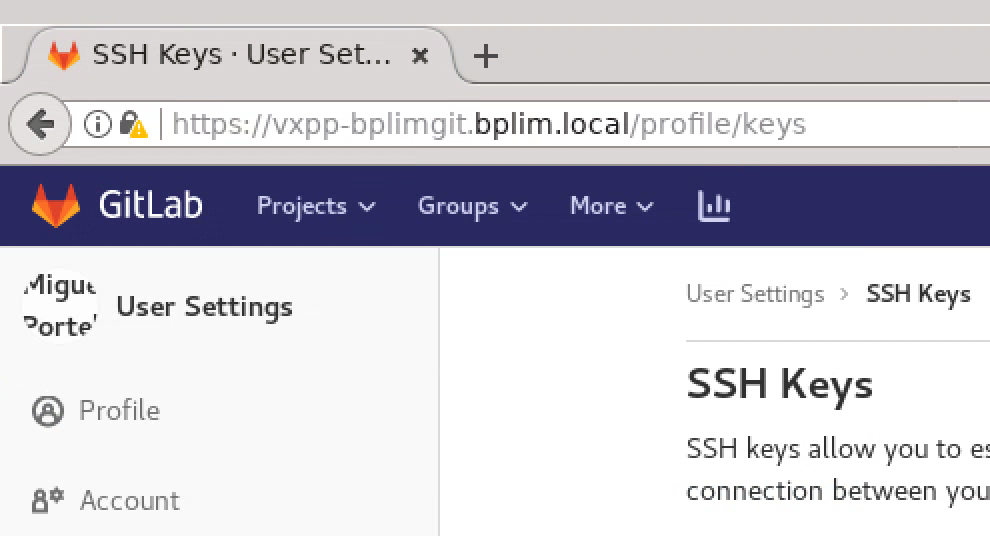{width=50%}

>


> 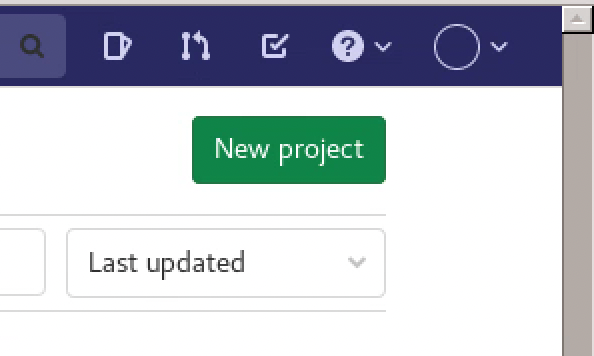{width=40%}

>


Configure Git by editing/creating the `.gitconfig` file in your home folder. You can use KWrite (Red Hat → Search → KWrite). Example:

  ```bash
    [cola]
            spellcheck = false  
    [user]
            name = Investigador A
            email = investa@sxpe-bplim01.bplim.local
    [gui]
            editor = kwrite
  ```


6. **Clone the project**

In the Terminal, move to your `work_area` and clone the repository:

  ```bash
    cd /bplimext/projects/your_project_ID/work_area/
    git clone git@vxpp-bplimgit.bplim.local:investa/scripts_P999.git
  ```

7. **Add** the file `.gitignore` available in folder `tools` of your project:

  ```bash
    cd scripts_P999
    cp /bplimext/projects/your_project_ID/tools/
    gitignore .
  ```

8. **First commit & push**

  ```bash
    git add *
    git commit -a -m "First"
    git push
  ```

9. **Best practice**

Place all your scripts and code files in the `scripts_P999` folder. This ensures a structured and efficient workflow with version control.


## Containers

### Build Your Container

- You can create a container definition using the template files available in our [GitHub repository](https://github.com/BPLIM/Containers).

- Test your script and build the container using [SylabsCloud](https://cloud.sylabs.io/) (you can log in with your GitHub account).

- Click **CREATE**:

>

> {width=20%}

>

- In the next step, upload your `.def` file or copy/paste its contents into the text box:

>

> 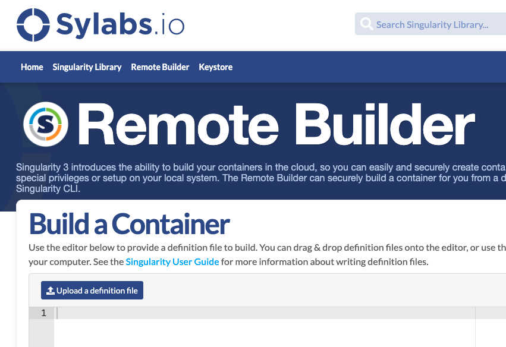{width=30%}

>

- Sylabs will validate your script. Once successful, the **Build** button will be enabled. Click it to proceed.

- Monitor the build process at the bottom of the screen and check for any error messages.

- Once the container builds successfully, send the **definition file with your changes** to the BPLIM Team.


### Use the container in BPLIM's server

1. Open a **Terminal**.

2. Move to your project’s container folder:

  ```bash
    cd /bplimext/projects/PXXX_name/tools/containers
  ```

3. Start the container

  ```bash
    singularity shell YOURPROJECTID.sif
  ```

4. The Terminal prompt will change to show: `Singularity`

5. Start RStudio by typing `rstudio` (small caps)

>

> {width=20%}

>

6. Once inside RStudio, you will have access to the original folder structure of your project.

## Jupyter Lab

Explore [Jupyter lab](https://jupyter.org/):

> *"JupyterLab is a web-based interactive development environment for Jupyter notebooks, code, and data.  
> It is flexible, allowing you to configure and arrange the interface to support diverse workflows in data science, scientific computing, and machine learning.  
> JupyterLab is also extensible and modular, enabling plugins that add new components or integrate with existing ones."*


### Starting JupyterLab

Run the following command in the Terminal:

  ```bash
    jupyter lab --browser=firefox
  ```

### Sample session

>

> {width=65%}

>

[^1]: Dolphin is an intuitive and easy-to-use file manager. You can use it, for example, to browse the directory, to
    create or delete files/directories (by using the right mouse
    button). For more information about Dolphin, please visit:
    [https://userbase.kde.org/Dolphin](https://userbase.kde.org/Dolphin)
    .

[^2]: In case 'xstata17mp.sh' does not launch Stata please see '[Statistical software](#statistical_software)'.

[^3]: Click on the cross button at the upper right corner to close.

[^4]: Note that before exiting the server, you need to make sure that all active programs have been closed (unless they have been launched in *batch* mode). Running programs in *batch* mode is justified for procedures that require high computational resources, intense calculation and/or long processing time.

[^6]: The version of Stata on the server has the same features as the Stata on Windows or Mac. By default when the Stata starts in this way the \"working directory\" active becomes your folder \"work\_area\".

[^7]: You may only remove text files that do not contain data or results that allow identification. For all the graphs you request as an output you must provide the corresponding Table to replicate it. You may only export graphs in .PNG format (no vector graph is allowed).

[^8]: Singularity is now called [Apptainer](https://apptainer.org). You can find further information here: [https://apptainer.org](https://apptainer.org).
