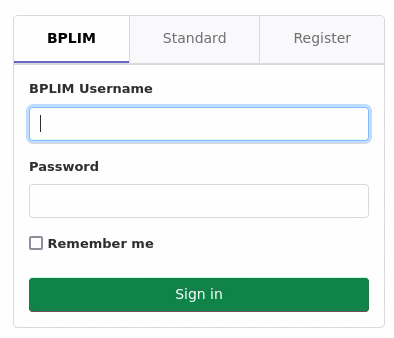
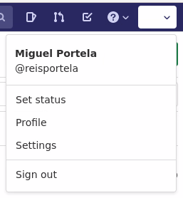
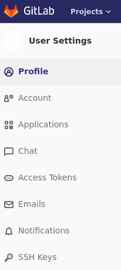
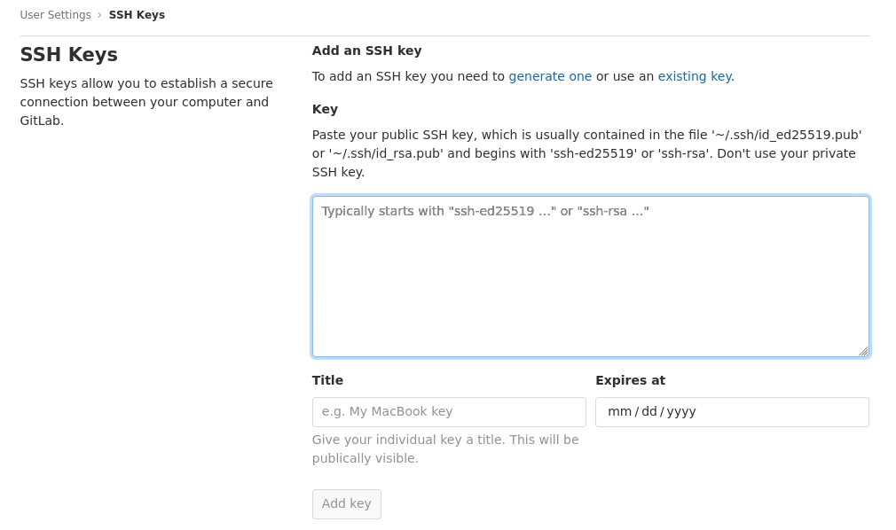
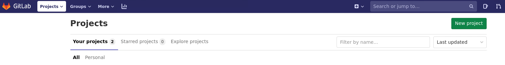
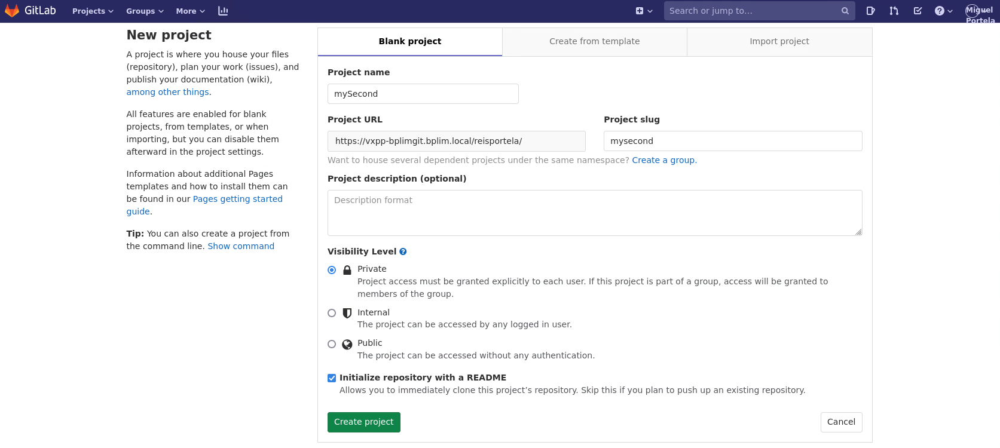
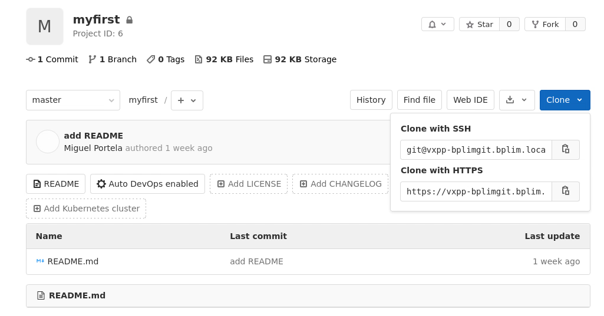
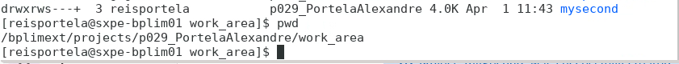

## Purpose

This guide is a quickstart for using Git on the BPLIM External Server. It covers the minimum setup required to create a repository in the internal GitLab server, clone it into your project `work_area`, and make your first commit.

For more detailed guidance and troubleshooting, see the Git section in the main External Server guide.

## Prerequisites

- Your project must be enabled for GitLab access by the BPLIM/DSI team.
- You must already be able to log in to the External Server.
- You should work inside your project's `work_area`, not in your home folder.

## Configure Git

Create or edit the `.gitconfig` file in your home folder. You can use KWrite to edit the file.

The `[user]` section is required. The `[cola]` and `[gui]` sections are optional but convenient in the BPLIM environment.

```ini
[user]
        name = Your Name
        email = username@sxpe-bplim01.bplim.local

[cola]
        spellcheck = false

[gui]
        editor = kwrite
```

Replace `Your Name` and `username` with your own details.

## Generate SSH Key

Open a Terminal in your home folder and run:

```bash
cd ~
ssh-keygen -t rsa -C "BPLIM git"
cat ~/.ssh/id_rsa.pub
```

Copy the full public key shown in the Terminal.

## Add SSH Key in GitLab

Open Firefox and go to:

[https://vxpp-bplimgit.bplim.local/](https://vxpp-bplimgit.bplim.local/)

{width=58%}

Log in with your External Server credentials.

Open your profile settings, go to **SSH Keys**, paste the copied key into the **Key** field, add a title such as `BPLIM git`, and click **Add key**.

{width=32%}

{height=90mm}

{width=60%}

## Create Project

In GitLab, go to **Projects** -> **New project** and create a repository for your project, for example `scripts_P999`.

{width=62%}

{width=54%}

## Clone Repository

Open a Terminal in your project `work_area` and clone the repository:

```bash
cd /bplimext/projects/P999_research_project/work_area/
git clone git@vxpp-bplimgit.bplim.local:username/scripts_P999.git
```

Replace `P999_research_project`, `username`, and `scripts_P999` with your own project path, GitLab username, and repository name.

{width=62%}

After cloning, a new folder with the repository name will be available in your `work_area`.

{width=80%}

## Add .gitignore

Move into the repository folder and copy the `.gitignore` template from your project's `tools` folder:

```bash
cd scripts_P999
cp /bplimext/projects/P999_research_project/tools/.gitignore .
```

## First Commit

Add your files, create the first commit, and push it to GitLab:

```bash
git add .
git commit -m "Initial commit"
git push
```

If other changes have already been pushed to the remote repository, run `git pull` before `git push`.

## Good Practices

::: {.callout-note appearance="simple"}
- Keep only scripts, code, and project documentation in the Git repository.
- Work inside your project's `work_area`.
- Commit regularly and use descriptive commit messages.
- Pull before pushing when working with collaborators.
:::

## Further Reading

- Git tutorial: [https://git-scm.com/docs/gittutorial](https://git-scm.com/docs/gittutorial)
- Full BPLIM workflow and troubleshooting: see the Git section in the External Server guide.
