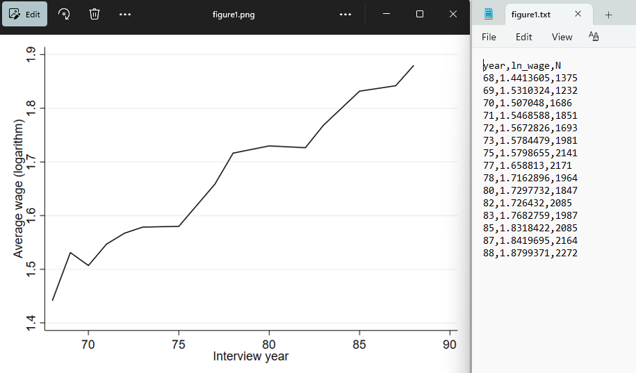

---
title: Output Control at BPLIM
author: "Banco de Portugal's Microdata Research Laboratory (BPLIM)"
date: 16 July 2026
fig-numbering: false
format:
  pdf: 
    documentclass: scrartcl
    papersize: A4
    toc: false
    toc-title: Contents
    toc-depth: 3
    number-sections: true
    include-in-header:
          text: |
            \usepackage{caption}
            \captionsetup[figure]{labelformat=empty}
            \usepackage{float}
            \floatplacement{table}{H}
            
            
  html:
    theme: cosmo
    embed-resources: true
    toc: true
    toc-location: left
    html-math-method: katex
    code-copy: true
    number-sections: true

##bibliography: references.bib
##csl: apa-6th-edition
##output:
  ##html_document:
    ##citation_package: citeproc
---

## Rules for Outputs Extraction at BPLIM

Only researchers identified in the project may request extraction of outputs. BPLIM will not check the “correctness” of the scripts used to produce the output files. The code is the sole responsibility of the researcher. However, researchers should abide by the following rules:

  > - Output files should never contain information that reveals individual records. This means that listings of individual records, tables with cells whose values were obtained by manipulation of three or less observation units, statistical measures with standard errors of zero, minimum and maximum values, etc., are not allowed. BPLIM may refuse the disclosure of output files if it perceives that the information in the logs may, directly or indirectly, reveal confidential information.
  
  > -	All outputs files must be generated by a script file which should be easy to identify. Requests for output extraction may be refused if BPLIM cannot associate the script file with the output. 
  
  > -	All aggregate statistics must report the underlying value of N. This means, for example, that all regression outputs must report the number of observations and tables must report the number of observations per cell. Depending on the type of data BPLIM may impose stricter criteria at its discretion and refuse the disclosure of regression output files where the number of observations and/or the variables included in the regression could lead to the identification of individual observations.
  
  > - For percentiles, the output table must include the corresponding number of observations. Percentiles should only be reported when they are based on at least the minimum number of observations specified in the table below:
  
\bigskip
  
| Percentile | Minimum observations |   
| :--- | :---: |   
| Medians (0.50) | 8 |   
| Quartiles (0.25, 0.5, 0.75) | 16 |   
| Quintiles (0.2, 0.4, 0.6, 0.8) | 20 |   
| Deciles (0.1, 0.2, 0.3 ... 0.9) | 40 |   
| Vigintiles (0.05, 0.1, 0.15 ... 0.95) | 80 |   
| Percentiles (0.01, 0.02 ... 0.99) | 400 |
\nopagebreak\vspace{-2mm}\centerline{\textit{Source: Adapted from Australian Bureau of Statistics (2021) and UK Office for National Statistics (2022)}}\vspace{6mm}
   
  > -	Output files of results must be plain text files (allowed formats are “txt”, “csv”, “log” and “tex”).
  
  > -	Comments in output files should not include references to data values.
  
  > - The only graphical outputs allowed are “png” files. Each graph file must be accompanied by a plain-text file with a table specifying the number of observations represented by each data point (see example below). The plain-text file must have the same base filename as the corresponding graph file. For certain types of graphs, such as boxplots, researchers must ensure that individual observations or values that could disclose confidential information are not displayed (e.g. minimum and maximum values). All graphical outputs must comply with the statistical disclosure control rules outlined above.    
  

  > -	Researchers should keep their output requests to a minimum and, wherever possible, request only final outputs. Unusually large requests may require additional processing time. In some cases, if the requested output is excessively long, researchers may be asked to revise their request or, where necessary, the request may be rejected.
  
  
Researchers working on projects that use modified data should run their code using the Replication App. This will generate a self-contained folder and results for extraction should be stored in a dedicated subfolder. As the results produced using modified data are not valid for research purposes, researchers must request, by email, that BPLIM replicate the code on the original data and extract the corresponding outputs.

For projects that use original anonymized data, researchers should save all outputs in the `results` folder and email *bplim@bportugal.pt* to request output extraction. Please include the project number in the email subject line.

Please note that output verification depends on staff availability and may take longer during periods of high workload. BPLIM processes output extraction requests only when they are submitted by email and will take the time necessary to ensure that all confidentiality requirements are fully met before releasing any results.
